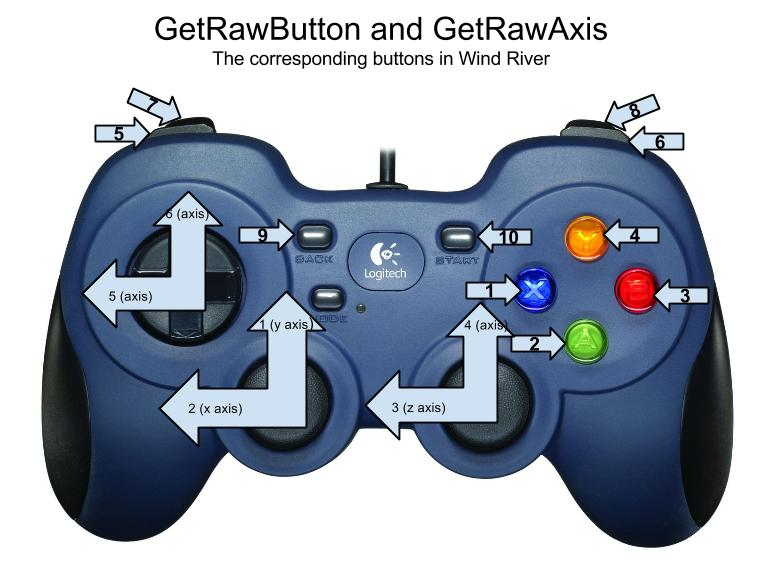
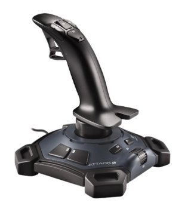

## The Joystick

**Logitech Gamepad F310**


Logitech has made a home-touch-feely controller as it appears to be a standard controller. Most people have played video games with a controller like this, so there’s nothing new to learn about it. On the back is a little slide button, make sure it is set to the right and tape it like that to prevent incidents of bad joystick. Make sure mode light is off.

[AndyMark](http://www.andymark.com/product-p/am-2064.htm)



**Logitech Attack 3 USB Joystick**



This Attack 3 Joystick looks awesome, doesn’t it exude the feeling of robotics? One hand to move the single joystick, the other to press the buttons on the bottom. The joystick class in the WPI Library does support this joystick and all if its many inputs.

[FIRST Choice](http://firstchoicebyandymark.com/fc15-064)

[Joystick Class (C++)](http://mililanirobotics.org/documentation/electrical/WPILib2015C++/classJoystick.html)

###➠ Sample Code
```c++
#include "WPILib.h"
class Robot: public SampleRobot
{
	Joystick stick;
public:
	Robot() :
		stick(0) // Use joystick on port 0.
	{
	}
	void OperatorControl()
	{
		while(IsOperatorControl())
		{
			if(stick.GetRawAxis(1) > .2)
			{
			}
			if(stick.GetRawAxis(2) > .2)
			{
			}
			if(stick.GetRawButton(1) == 1)
			{
			}
			if(stick.GetRawButton(4) == 1)
			{
			}
			if(stick.GetTop() == 1)
			{
				if(stick.GetRawAxis(3))
				{
				}
				if(stick.GetRawAxis(4))
				{
				}
			}
		}
	}
};

START_ROBOT_CLASS(Robot);
```

###➠ Explanation
```c++
Joystick stick;
```
Declare one `Joystick` object. Declared between `class RobotDemo : public SampleRobot` and `public : RobotDemo(void):`

```c++
stick(0);
```
Instantiate one `Joystick` object in USB port of computer (limited to # of USB ports on computer). Instantiation occurs between the `public : RobotDemo(void):` and the braces(`{ }`). If not the last instantiated object in list, it needs a comma after instantiation statement like listing. If it is, it does not need any punctuation after the instantiation before the braces; no comma, no semicolon, no period, etc. If syntax not followed, error occurs.

```c++

void OperatorControl()
{
	while(IsOperatorControl())
	{
		if(stick.GetRawAxis(1) > .2)
		{
		}
		if(stick.GetRawAxis(2) > .2)
		{
		}
		if(stick.GetRawButton(1) == 1)
		{
		}
		if(stick.GetRawButton(4) == 1)
		{
		}
		if(stick.GetTop() == 1)
		{
			if(stick.GetRawAxis(3))
			{
			}
			if(stick.GetRawAxis(4))
			{
			}
		}
	}
}
```
Joystick functions are the sauce for conditions in `OperatorControl`. By doing certain actions on the joystick object (this instance is using a Logitech F310 Gamepad), it executes the code that would be written in the braces. For example, `GetRawAxis(1)` corresponds to the left stick y-axis(up and down) of the F310 Gamepad or the y-axis of the Extreme 3D Pro joystick; the | |(or) corresponds to positive(up) or negative(down) input. The axis is usually associated with driving the robot. `GetRawButton()` only returns 1 if it is being pressed; `GetRawButton(1)` is the x-button on the F310 Gamepad or the trigger of the Extreme 3D Pro joystick. `GetTop` is the smaller stick on the Extreme 3D Pro, and it only returns `1` if top is being used or `0` if not, so extra conditions for axis 3 & 4, y-axis and x-axis of top respectively. For the F310 Gamepad it would be axis 6 & 5, y-axis and x-axis respectively.
