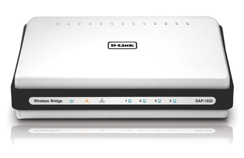

# The D-Link
###Introduction
  
We control the robot through a Logitech gamepad controller. Generally, we wouldn’t want to follow the robot around with an ethernet cable, so we solve this problem by connecting wirelessly. We use the D-Link as a medium to communicate with the robot in this fashion.
