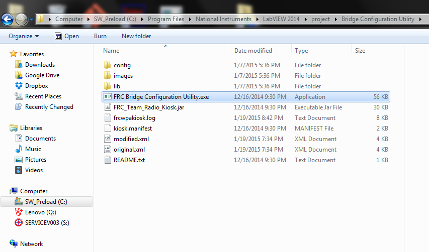
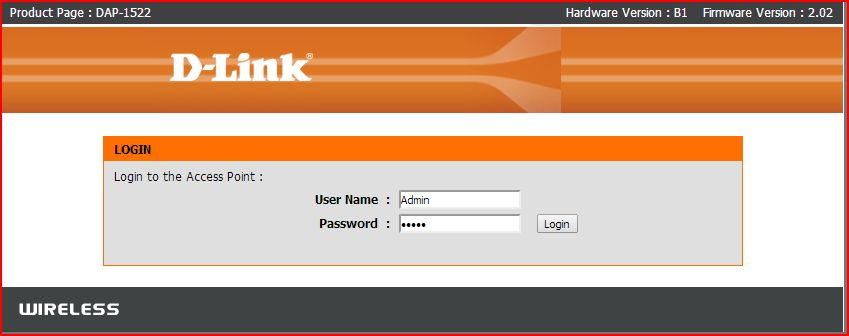
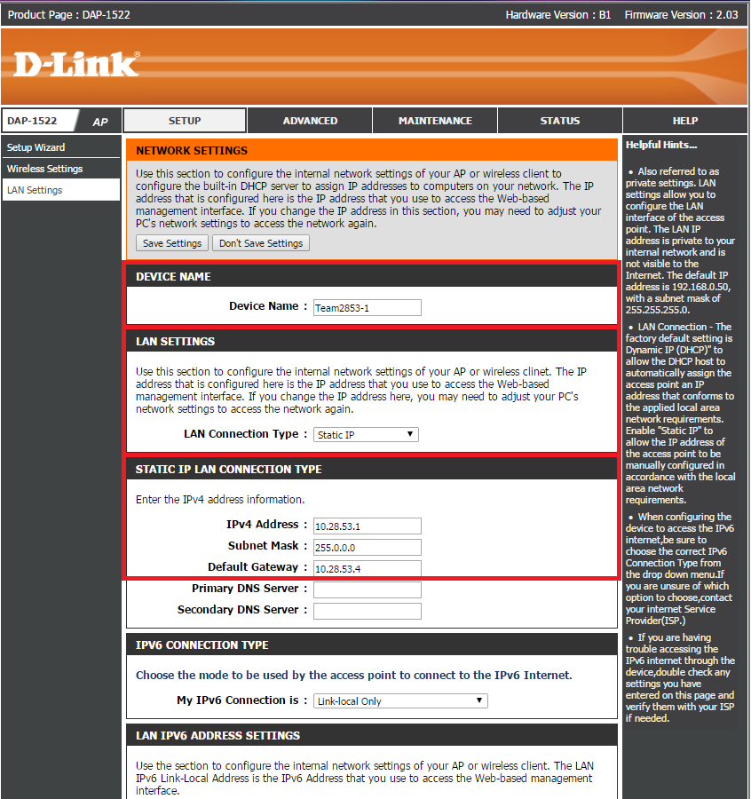
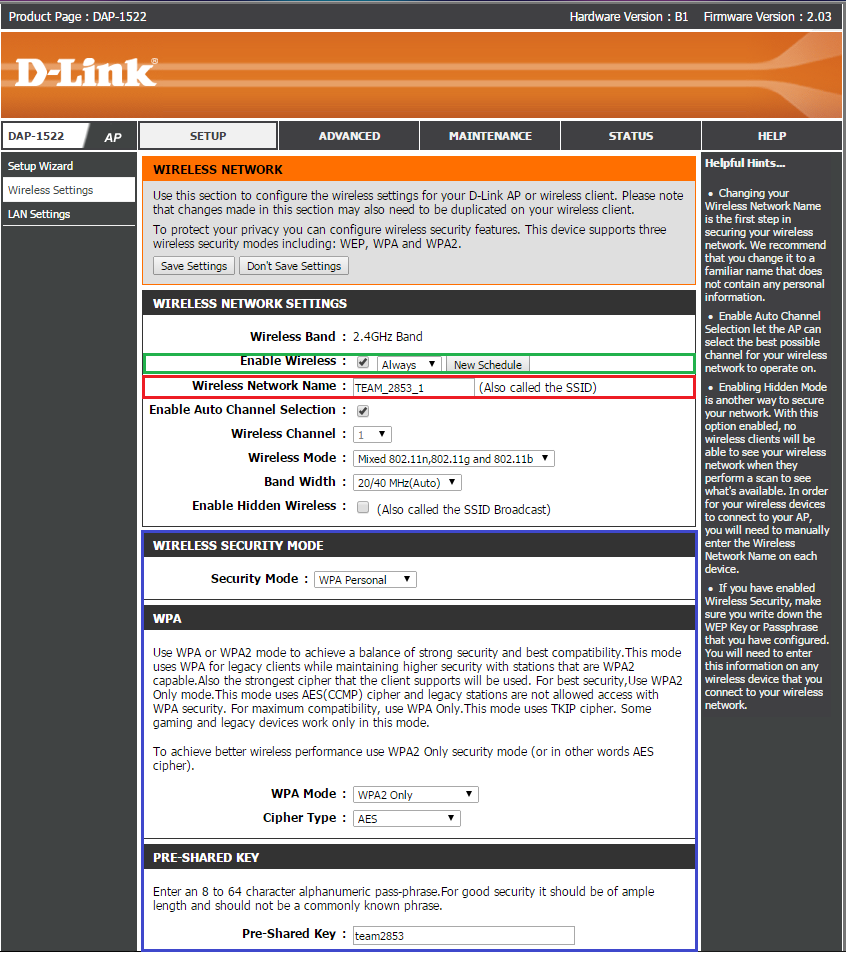

# Automatic Configuration
###➠ 2015 Configuration Prerequisites
1. Make sure that the router is switched to the Access Point mode you request (2.4 Ghz, 5.0 Ghz, Bridge). A setting of 2.4 Ghz is appropriate for most FRC teams and should be used as the default.
2. Ensure that your computer has Java installed. If you’re unsure or need to check or download the Java software, use this link: http://www.java.com/en/download/index.jsp
3. Also ensure that the NI Suite is updated, which includes the FRC Bridge Configuration Utility to configure a router to use in FRC. To download the New FRC Software, use this link: http://wpilib.screenstepslive.com/s/4485/m/13503/l/144150-installing-the-frc-2015-update-suite-all-languages
NOTE: To reset the router press and hold the reset button for 30 seconds to perform a factory reset to wipe any previous configurations

###➠ FRC Bridge Configuration Utility
**NOTE:** If the router is not brand new, it is not necessary to press and hold the reset button for 30 seconds to perform a factory reset to wipe any previous configurations because the FRC software will do so for you.
1. Turn off the Wifi on your computer
2. Make sure the physical layer on the router is setup properly.
3. Launch the FRC Bridge Tool software. It is located under the National Instruments folder, and its default location is C:\Program Files\National Instruments\LabVIEW 2014\project\FRC Bridge Configuration Utility.exe  
  
4. Under the Network Interfaces popup from the Bridge Configuration Utility, Select “Local Area Connection” and press OK. If there are no network interfaces shown, click the refresh button.  
  
5. Under the FRC Bridge Configuration Utility, Type in your FRC team number as well as a password to be set under the section for “WPA Key.” Ensure that the Radio option is set to DAP1522 RevB, and that the Mode option is set to the current prerequisite setting (default of 2.4GHz Access Point should be used). Now click “Configure.”  
  
6.  Wait until the Configuration Progress is complete, and then press OK once it is done! Note that the router SSID can be configured through the D-Link ap
 

Manual Configuration
1. Open up your web browser (Firefox, Chrome, etc.)
2. In the address bar, type in the IP address of the router. It’s either:  
    **192.168.1.1**, the default IP address  
    **8OR 10.xx.yy.1**, where **xx** is the first two          digits of your team’s # (it can be one digit if your       team has a three-digit #) and **yy** is the last two  
    **OR** type in dlinkap/ and hit enter.
3. You’ll get a prompt for the router name and password like the one shown below. On a brand new router or a router that was reseted, the login info will be this:  
**User Name: Admin**  
**No Password (by default)**  

###➠ Setup: LAN Settings

➠ Set a Device Name: Team**xxxx-y**  
    **xxxx** = Your team number to avoid confusion.       **y** = Arbitrary but unique number to your router to      avoid confusion. You should base it on the number of       routers your team owns.
Example Device Name: **Team2853-1**  
➠ Set the LAN Connection type:  **“Static IP"**  
➠ Configure the *IPv4 Address, Subnet Mask, and Default Gateway*  
    IP Address: 10.**xx.yy.1**  
	**xx.yy** = Your Team Number  
        **xx** *can both be the one digit if your team has         a three-digit number*  
    *Example IP Address:* **10.28.53.1**  
    *Subnet Mask:* **255.0.0.0**  
    *Default Gateway:* **10.28.53.4**
###➠ Wireless Settings

Enable Wireless:  
**Checkmark** the Box  
Set to **Always**  
Wireless Network Name:   
Name it to (**whatever you want**)  
 Wireless Security Mode:   
Security to **WPA Personal**  
WPA mode to **WPA2 Only**  
Cipher Type to  **AES**  
Pre-shared key is the **Network Security Key**
