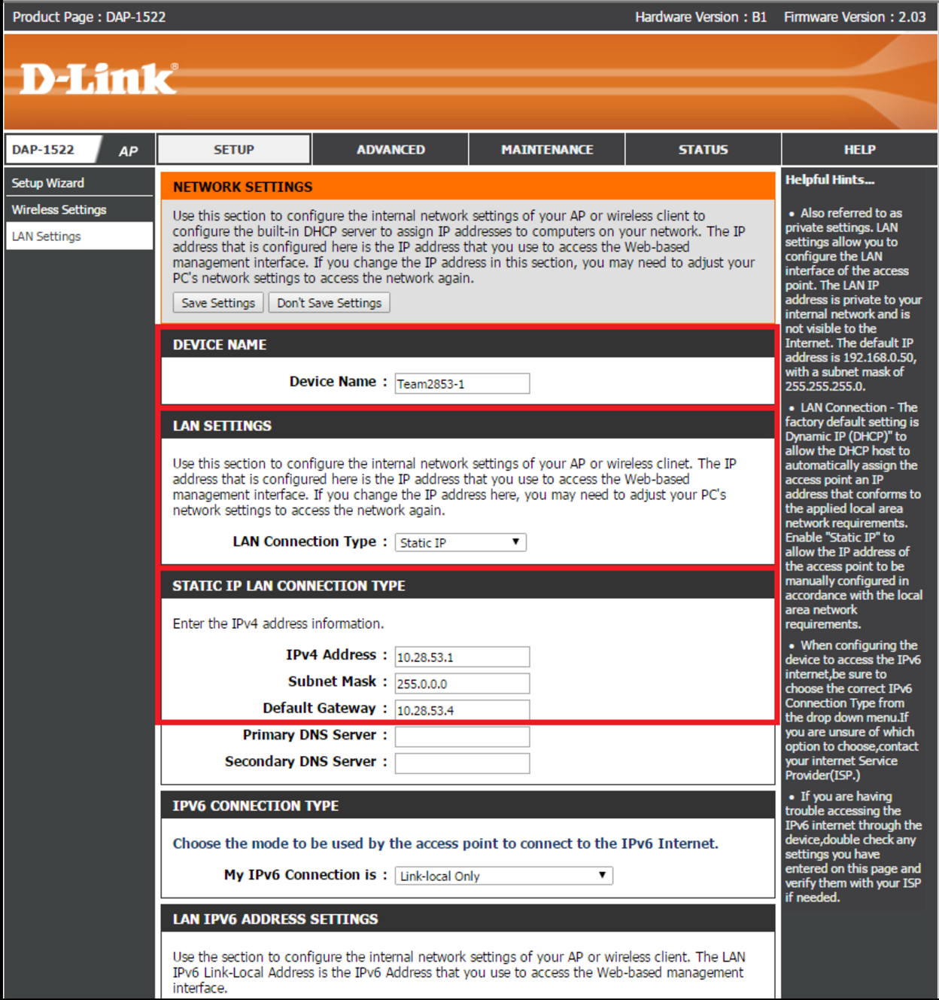

# Manual Configuration

1. Open up your web browser (Firefox, Chrome, etc.)
2. In the address bar, type in the IP address of the router. It’s either:
    * **192.168.1.1**, the default IP address
**OR** 
    * **10.xx.yy.1**, where **xx** is the first two digits of your team’s # (it can be one digit if your team has a three-digit #) and **yy** is the last two
**OR** 
    * type in **dlinkap/** and hit enter. 
3. You’ll get a prompt for the router name and password like the one shown below. On a brand new router or a router that was reseted, the login info will be this:

    **User Name: Admin** 
    
    **No Password (by default)**

### ➠ Setup: LAN Settings

➠ Set a Device Name: Team**xxxx-y**

* **xxxx** = Your team number to avoid confusion.

* **y** = Arbitrary but unique number to your router to avoid confusion. You should base it on the number of routers your team owns.

    Example Device Name: **Team2853-1**

➠ Set the LAN Connection type: “**Static IP**”

➠ Configure the *IPv4 Address, Subnet Mask, and Default Gateway*:

* IP Address: 10.**xx**.**yy**.**1**
	xx.yy = Your Team Number
    
    * **xx** can both be the first digit if your team has a three-digit number
* *Example IP Address*: **10.28.53.1**
* *Subnet Mask*: **255.0.0.0**
* *Default Gateway*: **10.28.53.4**

### ➠ Wireless Settings

**(red) Enable Wireless:**
* **Checkmark** the Box
* Set to **Always**

**(green) Wireless Network Name:**
* Name it to **(whatever you want)** - you may want to implement a naming system so you don't get multiple routers confused.

**(blue) Wireless Security Mode:**
* Security to **WPA Personal**
* WPA mode to **WPA2 Only**
* Cipher Type to **AES**
* Pre-shared key is the **Network Security Key**
