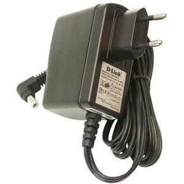
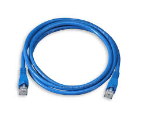
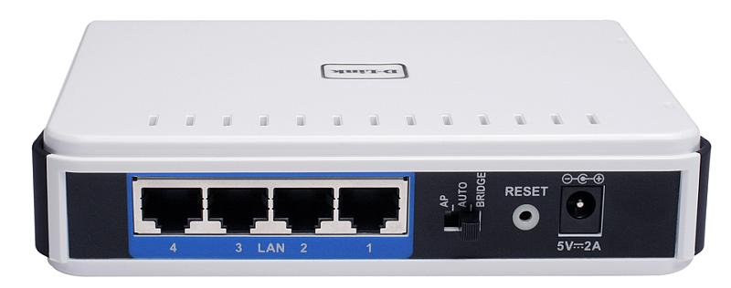

# The Physical Layer
### ➠ The Voltage Regulator Module
As of the 2015 FRC game, Recycle Rush, the DLink is required to be powered by the 5V/2A AKA “Radio” port on the Voltage Regulator Module. You can read more about it under “The Power Distribution Panel”  

  
The D-Link itself is connected to a power adapter that is:  
* 5V Output
* Power Cable to D-Link Model No: AMS3-0502000 FU
    * Barrel 5.5/2.1mm
 

[AndyMark - Power Converter |](http://www.andymark.com/product-p/am-0899.htm)

 
The D-Link connects to the cRIO via a Standard CAT-5 Ethernet Cable. It can also act as the “middle-man” with an Ethernet cable connecting to the Driver Station laptop.
 

* Make sure the router has power
* Make sure the ethernet cables are plugged in securely (on both ends)

NOTE: It doesn’t matter which LAN Ports the ethernet cables are plugged into. However, by convention we usually make sure that the roboRIO connects to port 2 and a computer plugs into port 1.
