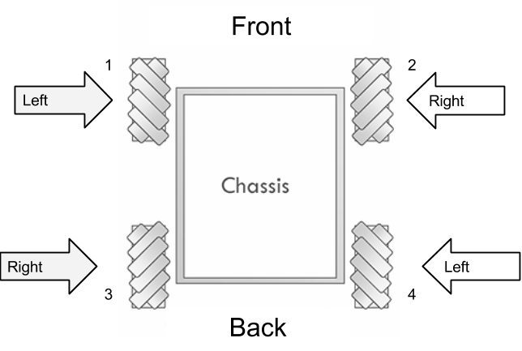
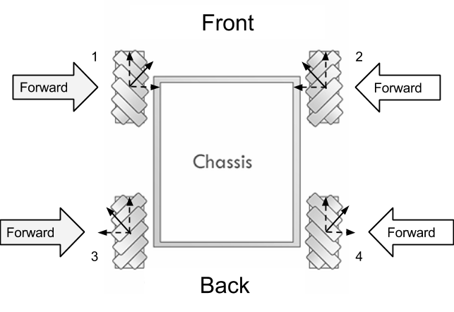
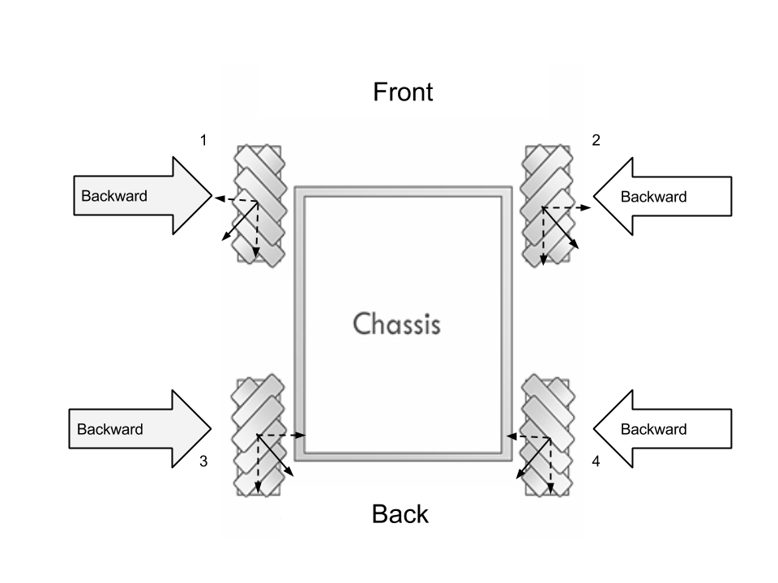
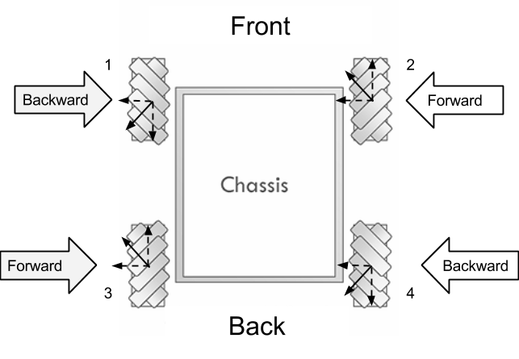
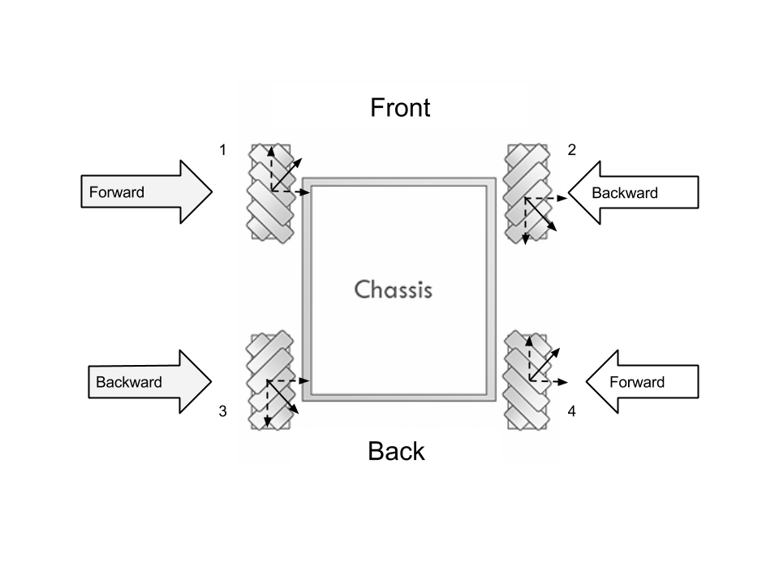
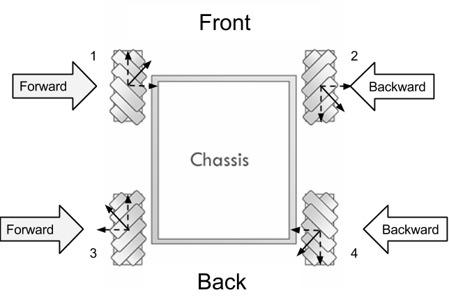
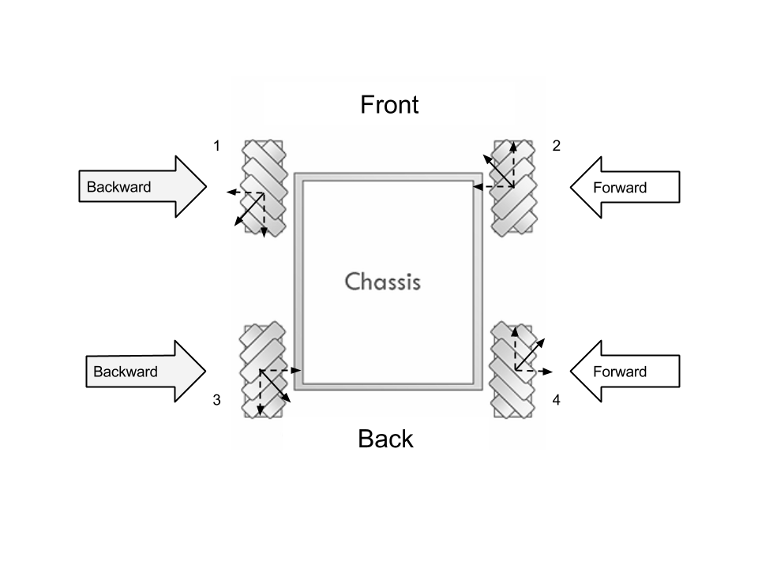

## Custom Program (Mecanum Drive)

#### ➠ Introduction & Wheel Configuration

The Mecanum Drive allows the robot to move forward, backward, and strafe. This is possible due to the nature of the wheels, which slip because of the rollers on them. They will naturally travel in a 45 degree motion in the direction that the entire wheel is rotating. When working with mecanum wheels, it is important to consider the weight distribution of the robot frame because mecanum wheels are designed for robots with an even weight distribution. An uneven weight distribution will cause wheels supporting more weight to have more traction than the wheels supporting less weight. This difference in traction will modify the effective rotation of each wheel, and the effect of the mecanum drive is lost.



**Left configuration**

* Rotating Forwards: motion 45 degrees **north of east**
* Rotating Backwards: motion 45 degrees **south of west**
* Used by: **Wheel 1**, front left, and **Wheel 4**, back right.

**Right Configuration**

* Rotating Forwards: motion 45 degrees **north of west**
* Rotating Backwards: motion 45 degrees **south of east**
* Used by: **Wheel 2**, front right, and **Wheel 3**, back left.

#### ➠ Movement Configuration
**Driving Forward**

Wheels 1, 2, 3, and 4 are rotating forward to allow the drive frame to drive forward.



**Driving Backward**

Wheels 1, 2, 3, and 4 are rotating backward to allow the drive frame to drive backward.



**Strafing Left**

Wheels 2 and 3 are rotating forward, Wheels 1 and 4 are rotating backward to allow the drive frame to strafe toward the left.



**Strafing Right**

Wheels 1 and 4 are rotating forward, Wheels 2 and 3 are rotating backward to allow the drive frame to strafe toward the right.



**Turning Clockwise**

Wheels 1 and 3 are rotating forward, Wheel 2 and 4 are rotating backward to allow the drive frame to rotate clockwise about its center


**Turning Counter-Clockwise**

Wheels 2 and 4 are rotating forward, Wheels 1 and 3 are rotating backward to allow the drive frame to rotate counter-clockwise about its center



#### ➠ Sample Testing Code

```c++
#include "WPILib.h"
#include “Math.h”

class RobotDemo : public SampleRobot {
    Victor leftFront; // Initializing motor 1; front-left motor
    Victor leftBack; // Initializing motor 3; back-left motor
    Victor rightFront;// Initializing motor 2; front-right motor
    Victor rightBack; // Initializing motor 4; back-right motor
    Joystick logitech; // Logitech Gamepad Controller

public:
    RobotDemo():
        leftFront(1),   // leftFront motor uses PWM port 1
        leftBack(2), // leftBack motor uses PWM port 2
        rightFront(3), // rightBack motor uses PWM port 3
        rightBack(4), // rightBack motor uses PWM port 4
        logitech(1) // Logitech Game Controller with Driverstation port 1
    {
    }

    void OperatorControl() {
    	  int leftFrontPolarity = 1; // These variables flip the sign value of
    	  int leftBackPolarity = 1; // the motors in the situation that they are
    	  int rightFrontPolarity = -1; // flipped
    	  int rightBackPolarity = -1;
    	  while (IsOperatorControl()) {
            float x = 0; // x-axis motion-right (+), left (-)
            float y = 0; // y-axis motion-forward (+), backward (-)
            float z = 0; // z-axis motion-clockwise (+), counterclockwise (-)
            if (fabs(stickOne.GetRawAxis(1)) > .2)
				z = stickOne.GetRawAxis(1); // z-axis threshold
            if (fabs(stickOne.GetRawAxis(2)) > .2)
				y = -(stickOne.GetRawAxis(2)); // y-axis threshold
            if (fabs(stickTwo.GetRawAxis(1)) > .2)
				x = stickTwo.GetRawAxis(1); // x-axis threshold

		    // y-axis motion
            if (fabs(y) > fabs(x) && fabs(y) > fabs(z)) //Activates if y is largest {
				leftFront.Set(y * leftFrontPolarity);
				rightFront.Set(y * rightFrontPolarity);
            	leftBack.Set(y * leftBackPolarity);
            	rightBack.Set(y * rightBackPolarity);
			}
		    // x-axis motion
            if (fabs(x) > fabs(y) && fabs(x) > fabs(z)) //Activates if x is largest {
				leftFront.Set(x * leftFrontPolarity);
				rightFront.Set(x * rightFrontPolarity * -1);
            	leftBack.Set(x * leftBackPolarity * -1);
            	rightBack.Set(x * rightBackPolarity);
			}

            // z-axis motion
	        else if (fabs(z) > fabs(y) && fabs(z) > fabs(x)) {
                leftFront.Set(z * leftFrontPolarity);
                rightFront.Set(z * rightFrontPolarity * -1);
           	    leftBack.Set(z * leftBackPolarity);
                rightBack.Set(z * rightBackPolarity * -1);
            }
            // Otherwise sticks are not pushed
            else {
                leftFront.Set(0);
            	leftBack.Set(0);
                rightFront.Set(0);
        	    rightBack.Set(0);
            }
            Wait(0.005);
        }
    }
};
START_ROBOT_CLASS(RobotDemo);
```

#### ➠ The Explanation
Breakdown of the code follows as so:

```c++
#include "WPILib.h"
#include "Math.h"
class RobotDemo : public SimpleRobot
{
    Victor leftFront; // Initializing motor 1; front-left motor
    Victor leftBack; // Initializing motor 3; back-left motor
    Victor rightFront;// Initializing motor 2; front-right motor
    Victor rightBack; // Initializing motor 4; back-right motor
    Joystick logitech; // Logitech Gamepad Controller
```
Here we instantiate the 4 motor controllers we are using to manipulate the 4 mecanum wheels on the robot under the `Victor` class (here we used Victor motor controllers). We also instantiated our Logitech Gamepad Controller under the `Joystick` class.

```c++
public:
    RobotDemo():
        leftFront(1),   // leftFront motor uses PWM port 1
        leftBack(2), // leftBack motor uses PWM port 2
        rightFront(3), // rightBack motor uses PWM port 3
        rightBack(4), // rightBack motor uses PWM port 4
        logitech(1) // Logitech Game Controller with Driverstation port 1
    {
    }
```
We further define our constructors by associating each piece of hardware to their respective ports. The `Victor` Class, which is a category of motor controllers, utilize PWM ports while the `Joystick` Class utilized for the Logitech Gamepad Controller utilizes the driver station (USB) ports

```c++
    void OperatorControl()
    {
        DriverStationLCD *screen = DriverStationLCD::GetInstance();
    	  int leftFrontPolarity = 1; // These variables flip the sign value of
    	  int leftBackPolarity = 1; // the motors in the situation that they are
    	  int rightFrontPolarity = -1; // flipped
    	  int rightBackPolarity = -1;
```

These variables are in place to control the polarity of the motors (whether they rotate forwards or backwards when pushing the left and right sticks in a certain direction). This makes it easier to fix the code in the event of a motor being reversed.

```c++
    	  while (IsOperatorControl()) {
             float x = 0; // x-axis motion-right (+), left (-)
             float y = 0; // y-axis motion-forward (+), backward (-)
             float z = 0; // z-axis motion-clockwise (+), counterclockwise (-)
```

This splits the axes of the motion so that they can be assigned based on how the thumbsticks are pushed. The pushing the left thumbstick on it’s y-axis will give a y-value (`+` = forward, `-` = backward), pushing the left stick on it’s x-axis gives a z-value (`+` = clockwise, `-` = backward), and pushing the right stick on it’s x-axis give a x-value (`+` = right, `-` = left).

```c++
            if (fabs(stickOne.GetRawAxis(1)) > .2)
				z = stickOne.GetRawAxis(1); // z-axis threshold
            if (fabs(stickOne.GetRawAxis(2)) > .2)
				y = -(stickOne.GetRawAxis(2)); // y-axis threshold
            if (fabs(stickTwo.GetRawAxis(1)) > .2)
				x = stickTwo.GetRawAxis(1); // x-axis threshold
```

This section assigns a value to the axes based on the orientation of the thumbsticks. A threshold is placed so that tiny accidental movements do not cause the robot to drift.

```c++
            // y-axis motion
            if (fabs(y) > fabs(x) && fabs(y) > fabs(z)) //Activates if y is largest {
				leftFront.Set(y * leftFrontPolarity);
				rightFront.Set(y * rightFrontPolarity);
            	leftBack.Set(y * leftBackPolarity);
            	rightBack.Set(y * rightBackPolarity);
			}
```

If the left stick is pushed more on it’s y-axis (forward / backward) than it or the right stick is pushed on their x-axis, then the robot will move forward or backwards depending on the direction of the thumbstick. Pushing forward will make all wheels rotate forward and pushing backwards makes all wheels rotate backward. Also, the speed of the motors depends on how much the left thumbstick is pushed along the y-axis.

```c++
 		    // x-axis motion
            if (fabs(x) > fabs(y) && fabs(x) > fabs(z))
             //Activates if x is largest {
				leftFront.Set(x * leftFrontPolarity);
				rightFront.Set(x * rightFrontPolarity * -1);
            	leftBack.Set(x * leftBackPolarity * -1);
            	rightBack.Set(x * rightBackPolarity);
			}
```
If the right stick’s x-axis magnitude is greater than any of the left stick’s axes, then the robot will strafe either right or left. Pushing the thumbstick to the right makes the left front and right back motors rotate forward while the other two reverse (used the vector diagram to determine direction). Pushing the thumbstick to the left makes the opposite happen, with the right front and left back rotating forward while the left front and right back reverse. Again, the speed of the motors depends on how large the magnitude of the right thumbstick’s x-axis is.

```c++
            // z-axis motion
	        else if (fabs(z) > fabs(y) && fabs(z) > fabs(x)) {
                leftFront.Set(z * leftFrontPolarity);
                rightFront.Set(z * rightFrontPolarity * -1);
           	    leftBack.Set(z * leftBackPolarity);
                rightBack.Set(z * rightBackPolarity * -1);
            }
```

If the magnitude of the left stick’s x-axis is greater than it’s own y-axis and the right thumbsticks x-axis, then the robot will rotate. If the left stick is pushed to the right, the left wheels will rotate forward and the right wheels will rotate backwards, making it turn clockwise, much like tank drive. The opposite happens when you push the stick to the left.

```c++
             else {
            	    leftFront.Set(0);
            	    leftBack.Set(0);
            	    rightFront.Set(0);
            	    rightBack.Set(0);
             }
```

This sets all the motors to `0` when the joysticks are not pushed in an assigned direction or are not pushed past the threshold

**Alternate Code**
(put this in place of all of the if else statements)
```c++
leftFront.Set(x-y-z);
leftBack.Set(-x-y-z);
rightFront.Set(x+y+z);
rightBack.Set(-x+y+z);
```

This code is used as a simplification of the one posted earlier. However, there is a fundamental difference in how these two operate. In the original code, you can only move in specific directions, like forward, backwards, right, left, and rotate, whereas in this version you can move in any combination of the three axes. This is achieved by bypassing if statements and just using addition and subtraction. This way also allows you to bypass the issue of making a specific variable for polarity, as you can just change the `+` or `-` for the specific motor. In this situation, the left motors were reversed, so it was necessary to change `+y` to `-y` and `+z` to `-z` as it is now. You also have to switch the sign of the `x` variable. If the left motors were not reversed, the code would be `leftFront.Set(-x+y+z)` and `leftBack.Set(x+y+z)`. However, there is an issue that exists within this code as it is possible for the set value for each motor to exceed 1 if you were to rotate while moving in another direction.

#### ➠ Tested and Modified Code

```c++
// This is temporary code that will be replaced in the bible upon final code completion
#include "WPILib.h"
#include "Math.h"

class RobotDemo : public SimpleRobot {
    Victor leftFront; // Initializing motor 1; front-left motor
    Victor leftBack; // Initializing motor 3; back-left motor
    Victor rightFront; // Initializing motor 2; front-right motor
    Victor rightBack; // Initializing motor 4; back-right motor
    Joystick stickOne; // Logitech Gamepad Controller
    Joystick stickTwo; // Logitech Gamepad Controller

public:
    RobotDemo():
        leftFront(1),   // leftFront motor uses PWM port 1
        leftBack(2), // leftBack motor uses PWM port 2
        rightFront(3), // rightBack motor uses PWM port 3
        rightBack(4), // rightBack motor uses PWM port 4
        stickOne(1), // Logitech Game Controller with Driverstation port 1
	  stickTwo(2) // Joystick with driverstation port 2
    {
    }

    void OperatorControl() {
    	DriverStationLCD *screen = DriverStationLCD::GetInstance();
    	int leftFrontPolarity = 1; // These variables flip the sign value of
    	int leftBackPolarity = 1; // the motors in the situation that they are
    	int rightFrontPolarity = -1; // flipped
        int rightBackPolarity = -1;
    	float x = 0; // x-axis motion-right (+), left (-)
        float y = 0; // y-axis motion-forward (+), backward (-)
        float z = 0; // z-axis motion-clockwise (+), counterclockwise (-)
    	while (IsOperatorControl()) {
            if (fabs(stickOne.GetRawAxis(1)) > .2)
				z = stickOne.GetRawAxis(1); // z-axis threshold
            if (fabs(stickOne.GetRawAxis(2)) > .2)
				y = -(stickOne.GetRawAxis(2)); // y-axis threshold
            if (fabs(stickTwo.GetRawAxis(1)) > .2)
				x = stickTwo.GetRawAxis(1); // x-axis threshold

            // y-axis motion
            // Activates if y is largest
            if (fabs(y) > fabs(x) && fabs(y) > fabs(z)) {
				leftFront.Set(y * leftFrontPolarity);
				rightFront.Set(y * rightFrontPolarity);
            			leftBack.Set(y * leftBackPolarity);
            			rightBack.Set(y * rightBackPolarity);
		    }
            // x-axis motion
            //Activates when x is largest
		    else if (fabs(x) > fabs(y) && fabs(x) > fabs(z)) {
			    if(x > 0) {
				 //Executes if x is greater than deadband of 0.5
                    if(fabs(x) >= 0.5) {
					    leftFront.Set(x * leftFrontPolarity * 1.1);
		                rightFront.Set(x * rightFrontPolarity * -0.95);
		                leftBack.Set(x * leftBackPolarity * -1.1);
		            	rightBack.Set(x * rightBackPolarity);
					}
					else if(fabs(x) > 0.35) {
					leftFront.Set(x * leftFrontPolarity * 0.9);
					rightFront.Set(x * rightFrontPolarity *-0.9);
					leftBack.Set(x * leftBackPolarity * -1.1);
					rightBack.Set(x * rightBackPolarity);
					}
				}
				else if(x < 0) {
					if(fabs(x) >= 0.5) {
					    leftFront.Set(x * leftFrontPolarity * 1.05);
                        rightFront.Set(x * rightFrontPolarity * -1);
                        leftBack.Set(x * leftBackPolarity * -1);
                    	rightBack.Set(x * rightBackPolarity);
					}
					else if(fabs(x) > 0.35) {
						leftFront.Set(x * leftFrontPolarity * 1.1);
						rightFront.Set(x * rightFrontPolarity * -1);
						leftBack.Set(x * leftBackPolarity * -1.1);
						rightBack.Set(x * rightBackPolarity);
					}
				}
			}
            // z-axis motion
			else if (fabs(z) > fabs(y) && fabs(z) > fabs(x)) {
                leftFront.Set(z * leftFrontPolarity);
                rightFront.Set(z * rightFrontPolarity * -1);
           	leftBack.Set(z * leftBackPolarity);
                rightBack.Set(z * rightBackPolarity * -1);
            }
            //turn left when pressing 5 
			else if(stickOne.GetRawButton(5)) {
	        	leftFront.Set(0.5);
			    rightFront.Set(0.3);
	        	leftBack.Set(0.3);
	        	rightBack.Set(0.3);
			}
			//turn right when pressing 4
			else if(stickOne.GetRawButton(4)) {
	        	leftFront.Set(-0.3);
			    rightFront.Set(-0.5);
	        	leftBack.Set(-0.3);
	        	rightBack.Set(-0.5);
			}
            // Otherwise sticks are not pushed
            else {
				leftFront.Set(0);
				leftBack.Set(0);
				rightFront.Set(0);
				rightBack.Set(0);
            }
			x = 0; // x-axis motion-right (+), left (-)
			y = 0; // y-axis motion-forward (+), backward (-)
            z = 0; // z-axis motion-clockwise (+), counterclockwise (-)
            screen -> PrintfLine(DriverStationLCD::kUser_Line1,"X: %f", stickOne.GetRawAxis(1));
            screen -> PrintfLine(DriverStationLCD::kUser_Line2,"Y: %f", stickOne.GetRawAxis(2));
            screen -> PrintfLine(DriverStationLCD::kUser_Line3,"Rotation: %f", stickTwo.GetRawAxis(1));
            screen -> UpdateLCD();
            Wait(0.1);
         }
     }
    void Test() {
    	while (IsTest()) {
    		// Forward polarity test
    	    if (stickOne.GetRawButton(6))
    			leftFront.Set(.3);
    		else if (stickOne.GetRawButton(7))
    			leftBack.Set(.3);
    		else if (stickOne.GetRawButton(11))
    			rightFront.Set(-.3);
    		else if (stickOne.GetRawButton(10))
    			rightBack.Set(-.3);
    		else {
    			leftFront.Set(0);
    			leftBack.Set(0);
    			rightFront.Set(0);
    			rightBack.Set(0);
    		}
    	}
    }
};
START_ROBOT_CLASS(RobotDemo);
```

#### ➠ The Explanation

Breakdown of the code follows as so:

```c++
#include "WPILib.h"

class RobotDemo : public SimpleRobot {
    Victor leftFront; // Initializing motor 1; front-left motor
    Victor leftBack; // Initializing motor 3; back-left motor
    Victor rightFront;// Initializing motor 2; front-right motor
    Victor rightBack; // Initializing motor 4; back-right motor
    Joystick stickOne; // Logitech Gamepad Controller
    Joystick stickOne; // Logitech Gamepad Controller
```

Here we instantiate the four motor controllers we are using to manipulate the 4 mecanum wheels on the robot under the `Victor` class (here we used Victor motor controllers). We also instantiated our two joysticks that will be controlling the motion of the robots

```c++
public:
    RobotDemo():
        leftFront(1),   // leftFront motor uses PWM port 1
        leftBack(2), // leftBack motor uses PWM port 2
        rightFront(3), // rightBack motor uses PWM port 3
        rightBack(4), // rightBack motor uses PWM port 4
        stickOne(1) // Logitech attack 3 with Driverstation port 1
        stickTwo(2) // Logitech attack 3 with Driverstation port 2
    {
    }
```

Here, we further define our constructors by associating each piece of hardware to their respective ports. The `Victor` Class, which is a category of motor controllers, utilize PWM ports while the Joystick Class utilized for the Logitech Attack 3 utilizes the driver-station ports.

```c++
    void OperatorControl() {
    	DriverStationLCD *screen = DriverStationLCD::GetInstance();
    	int leftFrontPolarity = 1; // These variables flip the sign value of
    	int leftBackPolarity = 1; // the motors in the situation that they are
    	int rightFrontPolarity = -1; // flipped
        int rightBackPolarity = -1;
    	float x = 0; // x-axis motion-right (+), left (-)
        float y = 0; // y-axis motion-forward (+), backward (-)
        float z = 0; // z-axis motion-clockwise (+), counterclockwise (-)
```

The top half of this section is meant to be in preparation for the situation where one or more wheels need to have their polarity (going forwards or backwards) flipped. The bottom half is meant to instantiate and construct the variables that will be representing our various axes of motion. These will be used to control the voltage sent to each individual motor.

```c++
while (IsOperatorControl()) {
        if (fabs(stickOne.GetRawAxis(1)) > .2)
			z = stickOne.GetRawAxis(1); // z-axis threshold
        if (fabs(stickOne.GetRawAxis(2)) > .2)
			y = -(stickOne.GetRawAxis(2)); // y-axis threshold
        if (fabs(stickTwo.GetRawAxis(1)) > .2)
			x = stickTwo.GetRawAxis(1); // x-axis threshold
```

This section serves two main purposes. The first one is setting a threshold for all axes of motion. The joysticks must be pushed past a value of .2 in order for its value to be considered valid. This is meant to prevent the robot from drifting due to the joystick not perfectly resting at 0. The second function is to assign each axis of motion to a joystick direction. In our scenario, we preferred to make pushing `stickOne` left and right rotate the vehicle counter clockwise and clockwise respectively. Pushing `stickOne` forwards and backwards correlates to forwards and backwards motion. Pushing `stickTwo` to the right and left correlates to strafing right and left.

```c++
        //y-axis motion
        //Activates if y is largest
        if (fabs(y) > fabs(x) && fabs(y) > fabs(z)) {
			leftFront.Set(y * leftFrontPolarity);
			rightFront.Set(y * rightFrontPolarity);
        	leftBack.Set(y * leftBackPolarity);
        	rightBack.Set(y * rightBackPolarity);
		}
```

The first line is dedicated to determining if the y-component (front and back) of `stickOne`’s position is greater in magnitude than its z-component (left and right) and `stickTwo`’s x-component (left and right). This is meant to make the robot only move in one direction at a time. The rest of the block is dedicated to making the robot move forward and backwards. Since all wheels rotate in the same direction, nothing needs to be flipped.

```c++
        // x-axis motion
        // Activates x when largest
        else if (fabs(x) > fabs(y) && fabs(x) > fabs(z)) {
			if(x > 0) {
				if(fabs(x) >= 0.5) {
				leftFront.Set(x * leftFrontPolarity * 1.1);
	                	rightFront.Set(x * rightFrontPolarity * -0.95);
	                   leftBack.Set(x * leftBackPolarity * -1.1);
	            		rightBack.Set(x * rightBackPolarity);
				}
				else if(fabs(x) > 0.35) {
				leftFront.Set(x * leftFrontPolarity * 0.9);
				rightFront.Set(x * rightFrontPolarity *-0.9);
				leftBack.Set(x * leftBackPolarity * -1.1);
				rightBack.Set(x * rightBackPolarity);
				}
			}
```

Much like the top, this section is only activated when the x-component of `stickTwo`’s position is larger than any of `stickOne`’s. However, this section is different as our robot would rotate slightly clockwise and drift slightly backwards. To address this, we had to manually add multipliers to certain motors to make them move slower or faster at certain intervals. We also had to separate left strafing and right strafing because they behaved differently. In the block above, we only see the right strafing portion of the code. This section is subdivided into two more sections, when the wheels are supplied at least half of their maximum voltage (>=.5) and when they are supplied only a little bit of voltage (.5 > v > 0.35). This was due to our drive reacting differently at different voltages. You’ll see multipliers like 1.1, -0.95 and 0.9 in the above code, this is because some wheels were rotating slower / faster than others. Multipliers with magnitudes below 1 are meant to slow the speed of that specific motor. Multipliers with magnitudes above 1 are meant to speed them up. Different signs (+ or -) are meant to reverse the direction of the wheel in order for the vectors to make the card move in the desired direction.

```c++
            else if(x < 0) {
		        if(fabs(x) >= 0.5) {
        		    leftFront.Set(x * leftFrontPolarity * 1.05);
                    rightFront.Set(x * rightFrontPolarity * -1);
                    leftBack.Set(x * leftBackPolarity * -1);
        	        rightBack.Set(x * rightBackPolarity);
        		}
    		    else if(fabs(x) > 0.35) {
        			leftFront.Set(x * leftFrontPolarity * 1.1);
        			rightFront.Set(x * rightFrontPolarity * -1);
        			leftBack.Set(x * leftBackPolarity * -1.1);
        			rightBack.Set(x * rightBackPolarity);
        		}
        	}
        }
```

This is the same as the portion before this, but for strafing to the left. Since this motion had different errors that strafing to the right did, we had to edit the multipliers until the robot strafed nicely.

```c++
        // z-axis motion
        else if (fabs(z) > fabs(y) && fabs(z) > fabs(x)) {
            leftFront.Set(z * leftFrontPolarity);
            rightFront.Set(z * rightFrontPolarity * -1);
            leftBack.Set(z * leftBackPolarity);
            rightBack.Set(z * rightBackPolarity * -1);
        }
```

This section of the code is for rotating the robot. Again, this is activated only when the magnitude of `stickOne`’s z-component (how much to the left or right it is) is larger than both the x and y components. In order to rotate, the right sight must always be going the direction opposite of where the joystick tells it to. This is why they have a -1 applied in their statements. Pushing `stickOne` to the right makes the robot rotate clockwise and pushing it to the left makes it rotate counterclockwise.

```c++
        //turn left when pressing 5
        else if(stickOne.GetRawButton(5)) {
        	leftFront.Set(0.5);
		    rightFront.Set(0.3);
        	leftBack.Set(0.5);
        	rightBack.Set(0.3);
		}
		//turn right when pressing 4
        else if(stickOne.GetRawButton(4)) {
        	leftFront.Set(-0.3);
		    rightFront.Set(-0.5);
        	leftBack.Set(-0.3);
        	rightBack.Set(-0.5);
		}
```

This section of the code is just a quick preset that we found to be useful. They make the robot move forwards and rotate slightly when either the 4 or 5-button is pressed. Pressing the 5-button makes it turn right and pushing the 4-button makes it turn left.

```c++ 
        // Otherwise sticks are not pushed
        else {
				leftFront.Set(0);
				leftBack.Set(0);
				rightFront.Set(0);
				rightBack.Set(0);
            }
```

The purpose of this section is to ensure that when the joysticks are at their resting positions or very near it that the motors will not rotate the wheels.

```c++
        x = 0; // x-axis motion-right (+), left (-)
        y = 0; // y-axis motion-forward (+), backward (-)
        z = 0; // z-axis motion-clockwise (+), counterclockwise (-)
```

Since this portion of the code is outside of the `IsOperatorControl` while loop, this makes sure that the motors will NOT rotate the wheels when the robot is not under control of the driver.
