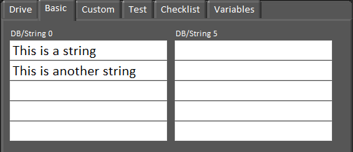

## Printing to Driver Station

With the 2015 update of the Driver Station, a maximum of 10 lines of strings (each allowing for 21 characters) can be manipulated to print to the Driver Station console. Note that the DriverStationLCD Class was removed entirely, and now printing is done through the Smartdashboard.



Unlike the DiverStationLCD print console, it is possible to type directly into the string fields as well as read these strings within your robot code. Some teams may find this useful when testing their robot code.

Strings can be sent to the Smartdashboard print console using the following code:

```c++
SmartDashboard::PutString("DB/String 0", "This is a string");
SmartDashboard::PutString("DB/String 1", "This is another string");
```

`SmartDashBoard::PutString` is calling the Smartdashboard and allows you to send strings to the Driver Station printing console. Each line is assigned a name from DB/String 0 to DB/String9 from top to bottom then left to right. The second set of quotations can be manipulated to send various strings.

Strings that are on or were sent to the Smartdashboard can then be retrieved using the following code:
```c++
std::string dashData = SmartDashboard::GetString("DB/String 0", "myDefaultData");
std::string dashData = SmartDashboard::GetString("DB/String 1", "myDefaultData");
```

Here we are creating a string within the code called dashData that is set to the string that was in the first and second line on the SmartDashboard printer console.
