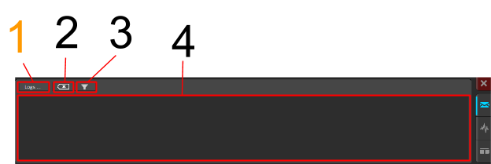

## The Interface
####➠ Main Display
This display is independent from the sections left and right of this display, it will always be in view(while Driver Station is open of course) even if you switch tabs on the Driver Station(See Tab Selection, also Charts & Messages)

1. Your Team #, this can be configured personally in the Setup Tab (See Tab Selection Section : ➠Setup Tab)

2. Current voltage of the battery in V (volts) has a visual indicator to the left in the form of a pictorial representation of a battery (fills like a bar to represent amount of charge).

3. Lights indicating the Driver Station’s status on detecting it: Red means there is no connection, green means a connection has been established. If you hover over each of the 3 lines, a troubleshooting message appears in the messages tab (See Charts & Messages) if light is red.

4. Displays current mode enabled or disabled unless the first two lights are red, in order, “No Robot Communication”, “No Robot Code” (See Tab Selection :  ➠Operation Tab for modes)

####➠ Tab Selection

Red boxes indicate tab selection and the highlighted tab is the current tab, in the blue box is the currently displayed tab(automatically displays Operations Tab when Driver

####➠ Operation Tab

1. The depressed button is what state the period is in; can press []\ to quickly enable, can press Enter button to quickly disable if the first two lights in Main Display are lit (Communications & Robot Code)

2. Available modes, current mode is depressed(Teleoperated by default), you can switch modes by clicking one of the 3 buttons

3. NEW: Visual indicator of your PC CPU % usage
Elapsed Time since you clicked “Enable” until disabled

####➠ Diagnostics Tab

1. What the Driver Station has communications with; if plugged through Ethernet directly to something (router or roboRIO), Enet Link will light up. DS Radio is a legacy indicator of ping status of an external radio at 10.TE.AM.4(Compared to last Driver Station, this light will usually not be lit except under specific circumstances[TESTING]) Bridge will be lit if connected to the router, Robot will be lit if it can communicate with the roboRIO. FMS should be lit if at competition since it is mandatory to communicate with the Field Management System. If unlit, you can hover over them for troubleshooting tips in the messages box (See Messages & Charts)

####➠ Setup Tab

1. Configure your team # here, click on the box type it in and boom

2. Practice timing controls how long Countdown till start of each period, Autonomous, Teleoperated, and how long endgame is. Delay is how much time is in between Autonomous and Teleoperated.

3. Type of dashboard you want to bring up, default auto brings up FRC PC Dashboard (ScreenSteps acknowledges an issue with setting Dashboard type to Java or C++ so to start up the SmartDashboard would require setting the default to SmartDashboard), Labview brings up FRC PC Dashboard, C++ and Java should bring up SmartDashboard, and remote is if the dashboard is on a separate computer/device

4. Field Management System protocol, protocol for DS to Field Management System communication; should be autoset to ‘15 which required for 2015 competition. Unless you were participating in week zero events in 2014, this won’t have to be touched

➠ USB Devices Tab

1. USB Setup list holds all compatible devices hooked up to the Driver Station (AKA, Laptop, usually 2, but with USB splitter, you can connect more) If you press a button on a connected device, it should be preceded by two asterisks (**) and highlighted in green. The rescan button forces a search of or for USB devices. While disabled, it automatically updates USB devices. Use the rescan button or press F1 to force search during a match.

**Locking & Rearranging**

1. To rearrange USB devices, drag & drop. When you drag & drop or double click on one of the devices, it underlines the device meaning it is “locked” Locked devices reserve the slot even while disconnected until reconnected, represented by greyed out and underlined.

####➠ Power & CAN

1. Amount of faults that occurred since last connection to Driver station; Comms mean DS to robot communication, 12V is Brownouts(See roboRio for details), 6V/5V/3.3V are User Voltage Rail faults(typically short circuits)

2. Utilization % is as it states and the other 4 are types of CAN faults since last connection to Driver Station

➠ Messages & Charts

1. Logs is an independent button of the tabs on this section of the DS

2. Clears all messages currently in the box

3. Message Filter: Filled in icon filters out warnings from being posted in message box, Outline posts everything

4. The message box, troubleshooting tips appear here, messages will appear here

 **Logs**

Loads up the DS Log File Viewer, you can view messages & event data in one display, a tool usually used for troubleshooting. This tool has its own section to be added elsewhere.

5.Charts trip time for data to robot with a green line vs the right axis, lost data packets to the robot is in “blue” vs the left axis

6.Graphs battery voltage with a yellow line vs the left axis, roboRIO cpu % usage with a red line vs the right axis

7.Time scale for the time axis of the graphs(12s, 1m, 5m)
