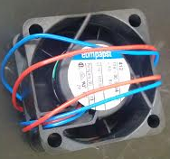

## Fans

Before the pedantic comment regarding our table of contents, no, fans are not motor controllers. They are, however, secured on top of motor controllers to cool them down; being fans and all. Talons and Victors have mounting holes that require 6-32 inch screws. The terminals connect to the V +/- side on the motor controller (you don’t want your fans turning off and on in unison with your motors).
