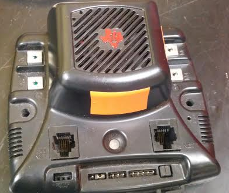
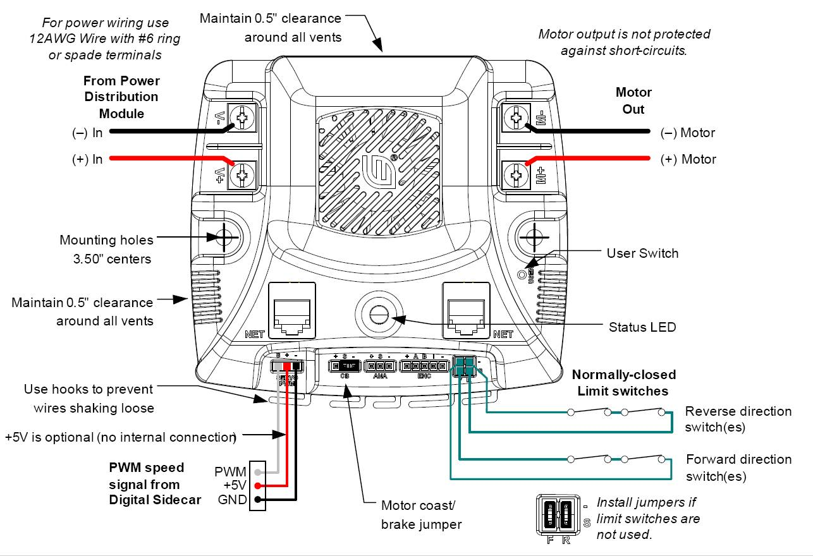
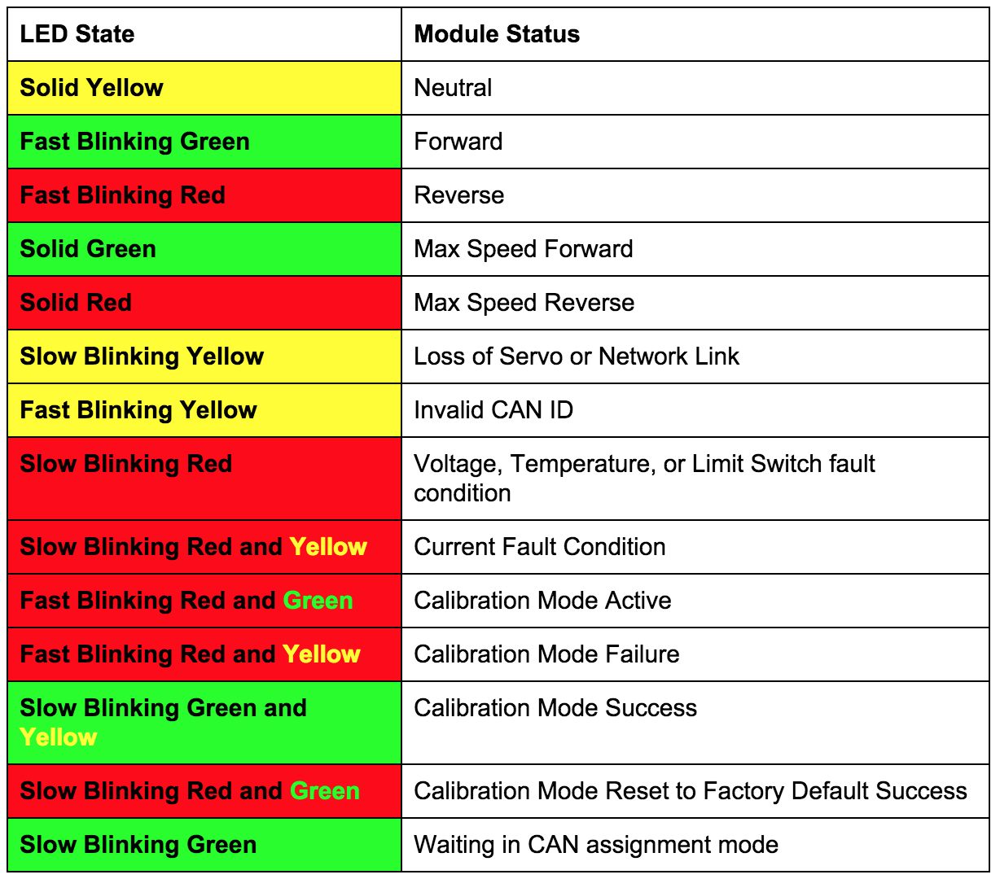

## Jaguar



There are jumpers that can be used in two places, the motor coast/brake, and the Limit Switches.  The motor coast/brake controls if after the robot stops it slowly decelerates (coasts), or immediately decelerates (brakes).  The jumpers are to be installed in the limit switch area if there are no limit switches being used.  Jaguars use the CAN network folder.  The status LED indicates many things like operation, fault, calibration, and other conditions using yellow, red, and green lights.





####➠ Sample Code

[**Jaguar Class (C++)**](http://mililanirobotics.org/documentation/electrical/WPILib2015C++/classJaguar.html)

```c++
#include "WPILib.h"

class RobotDemo : public SampleRobot
{
    Jaguar jaguar;
    Joystick stick;

public:
    RobotDemo(void):
        jaguar(1),
        stick(1)
        {
        }

    void OperatorControl()
    {
        if(stick.GetRawButton(1))
        {
            jaguar.Set(1.0);
        }
        else if(stick.GetRawButton(2))
        {
            jaguar.Set(-1.0);
        }
        else
        {
            jaguar.Set(0);
        }
    }
};

START_ROBOT_CLASS(RobotDemo);
```

####➠ Explanation

```c++
Jaguar jaguar;
```
Declare Jaguar motor controller as `jaguar`; declared between `public SampleRobot` and `public : RobotDemo`

```c++
jaguar(1),
```
Initialize Jaguar motor controller as port # 1 in Digital Sidecar (PWM Out), initialized between `public : RobotDemo` and the braces({ }). If it is not the last object initialized, it needs a comma like a list. If it is the last object initialized, no punctuation; no comma, no semicolon, no period, etc. or you will get an error.

```c++
void OperatorControl()
{
    if(stick.GetRawButton(1))
    {
        jaguar.Set(1.0);
    }
    else if(stick.GetRawButton(2))
    {
        jaguar.Set(-1.0);
    }
    else
    {
        jaguar.Set(0);
    }
}
```

Joystick class is gone into depth in an earlier section of this manual. Motor controllers are put into results of conditions because a free-spinning motor is a waste of power and there is no control over the motor(which is why it is a motor controller) The `.Set` method of the class accepts a float between -1.0 to 1.0 as a parameter and sets the speed of the motor to that float. 1.0 is full speed “forward”, -1.0 is full speed “backward.” The motor when initialized begins at `.Set(0)`. The `else jaguar.Set(0)` is to stop the motor because unless the motor controller is set to 0, the motor remains at the last `.Set()` value.
