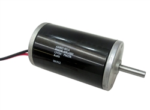
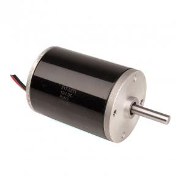
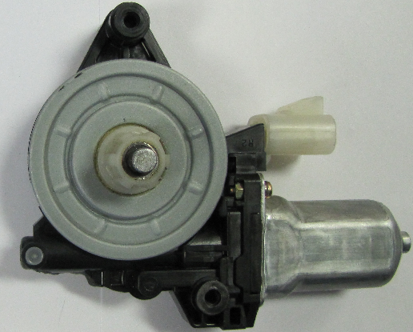
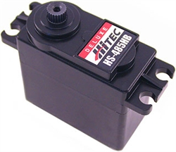

## Motors
####CIM motor

**Physical Specs**
* Size: 2.5 inch diameter, 4.34 inch long body
* Output Shaft size: 0.313 +/- 0.0004, with 2mm keyway
* Weight: 2.82 pounds
* Mounting Holes: #10-32 tapped holes (2), on a 2" bolt circle

**Performance**
* Voltage: 12 volt DC
* No load RPM: 5,310 (+/- 10%)
* Free Current: 2.7 amps
Maximum Power: 337 Watts (at 2655 rpm, 172 oz-in, and 68 amps)
* Stall Torque: 2.42 N-m, or 343.4 oz-in
* Stall Current: 133 amps

**[AndyMark](http://www.andymark.com/CIM-motor-FIRST-p/am-0255.htm)**

####mini-CIM motor

⅔ power of CIM, similar form factor and same mounting

**Physical Specs**
* Output Shaft size:8mm (0.314in) with 2mm keyway
* Size: 2.5” diameter, 3.36” long
* Weight: 2.16 lbs

**Performance**
* Free Speed:6,200 rpm (+/- 10%)
* Free Current:1.5A
* Maximum Power:230 W
* Stall Torque:12.4 in-lbs [1.4 N-m]
* Stall Current:86A
* Mounting Holes:(4) #10-32 tapped holes on a 2" bolt circle

**[Vex](http://www.vexrobotics.com/217-3371.html)**

####Window Motor

Make sure you remove the [locking pins](http://wiki.team1640.com/index.php?title=Nisso-Denko_%28Window%29_Motor_Locking_Pins).
* Stall Torque: 9.3 Nm
* Free Speed: 92 RPM
* Free Current: 2.5 A
* Stall Current: 25 A

#### Servo

Should **not** be hooked up to **ANY** motor controllers and directly to the PWM port in the roboRIO.

**[AndyMark](http://www.andymark.com/SearchResults.asp?Search=servo)**

#### ➠ Motor Controller Varieties

It is possible to control all the motors above (except the servo) with the below motor controllers; however, the breakers used have to be able to protect the wires and provide enough power for the motor used. For example, it is possible to connect 16 gauge wire with a 20 amp CB to a talon, but would not provide enough power if connected to say a CIM.
There are two side wires that connect to each motor controller: the M-/M+ and the V-/V+ side. The ‘M’ stands for Motor, which denotes the wires attached here should be the ones also attached to the motor.  The other side connects to the PDB. In both cases, the power goes to the + and ground to the -. There is also a thin slot where PWM cables plug into from the Digital Sidecar, with its direction based on the small notations on the motor controllers (often, ground is facing the side marked with a ‘B’).
