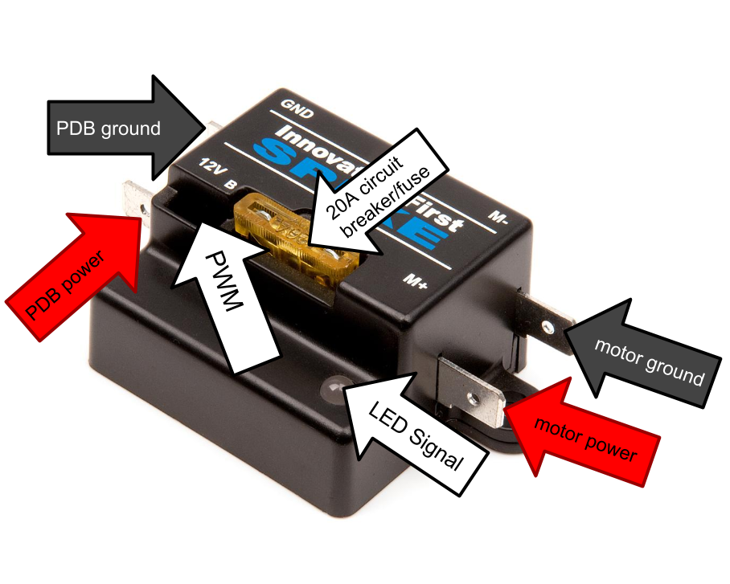
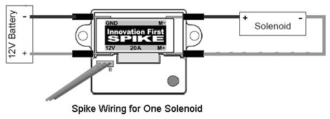
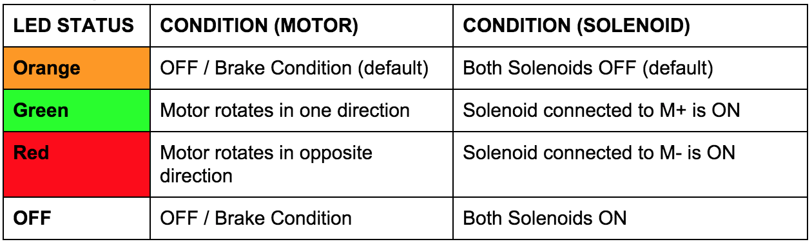

## Spike





*B indicates that the ground side of the PWM faces inward
*

Spikes are motor controllers used in driving small motors in forward, reverse, or stop (brake). It uses a **20A** circuit breaker. It can also be wired to compressors and solenoids and its indicator lights are different for motors and solenoids, as shown in the table below.



[**Spike User Manual**](http://www.mililanirobotics.org/documentation/electrical/2005%20Spike%20Blue%20Guide.pdf)

#### ➠ Sample Code

[**Relay Class (C++)**](http://mililanirobotics.org/documentation/electrical/WPILib2015C++/classRelay.html)

```c++
#include "WPILib.h"

class RobotDemo : public SampleRobot
{
	Relay spikeblue;
	Joystick stick;

public:
	RobotDemo():
		spikeblue(1,Relay::kForward),
		stick(1)
	{
	}

	void Autonomous()
	{
		spikeblue.Set(Relay::kOn);
	}

	void OperatorControl()
	{
	    while (IsOperatorControl())
		{
		    if(stick.GetRawButton(1))
			{
			    spikeblue.Set(Relay::kOn);
			}
		    else
			{
			    spikeblue.Set(Relay::kOff);
			}
		}
	}
};

START_ROBOT_CLASS(RobotDemo);
```

#### ➠ Explanation

```c++
Relay spikeblue;
```

Declare spike relay as name `spikeblue`. The declaration occurs between `class RobotDemo : public SampleRobot` and `public : RobotDemo():`

```c++
spikeblue(1,Relay::kForward),
```

Instantiate the spike relay with the parameters [Digital Sidecar Port#], [direction of current [kForward, kBackward, or kBothDirections]] This is instantiated between `public : RobotDemo():` and the braces (`{ }`).  If it is not the last object initialized, it needs a comma like a list. If it is the last object initialized, no punctuation; no comma, no semicolon, no period, etc. or you will get an error.

```c++
void Autonomous()
	{
		spikeblue.Set(Relay::kOn);
	}

void OperatorControl()
{
    while (IsOperatorControl())
	{
	    if(stick.GetRawButton(1))
		{
		    spikeblue.Set(Relay::kOn);
		}
	    else
		{
		    spikeblue.Set(Relay::kOff);
		}
	}
}
```

The Joystick class has already been covered in a previous section of the manual. Controls current to whatever is on the other side of the spike(one side connected to the PDB). In autonomous, if there is something wired to the spike that needs to be turned on, it can be `Set(Relay::kOn)`. To turn it off, use `Set(Relay::kOff)`. Note that it will not shut off automatically and hence manual off command. In `OperatorControl`, the relay will often be inserted inside  control statements to prevent loose relay on/off.Usually turning it on if button set in if condition is pressed otherwise relay off. Or vice versa if need be.
