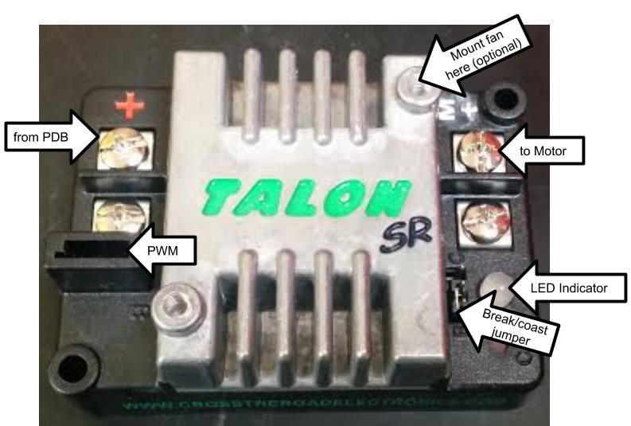
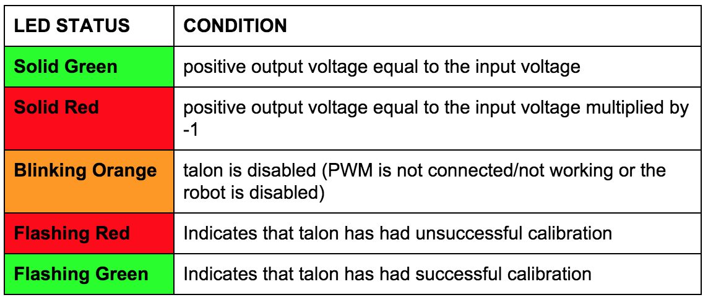

## Talon



The talon is interchangeable with the jaguar. It has a peak output of 100A and 60A continuous current. There are mounting holes for an optional 40mm fan. The LED on the talon is a status indicator.



[**Talon User Manual**](http://www.mililanirobotics.org/documentation/electrical/Talon%20User%20Manual.pdf)

#### ➠ Sample Code

[**Talon Class (C++)**](http://mililanirobotics.org/documentation/electrical/WPILib2015C++/classTalon.html)

```c++
#include "WPILib.h"

class RobotDemo : public SampleRobot
{
    Talon talon;
    Joystick stick;
public:
    RobotDemo(void):
        talon(1),
        stick(1)
        {
        }

    void OperatorControl()
    {
        if(stick.GetRawButton(1))
        {
            talon.Set(1.0);
        }
        else if(stick.GetRawButton(2))
        {
            talon.Set(-1.0);
        }
        else
        {
            talon.Set(0);
        }
    }
};

START_ROBOT_CLASS(RobotDemo);
```

####➠ Explanation

```c++
Talon talon;
```

Declare talon motor controller as `talon`; declared between `class : SampleRobot` and `public : RobotDemo`.

```c++
talon(1),
```

Initialize talon motor controller as connected to port #1 in the Digital Sidecar (PWM Out); initialized between `public : RobotDemo` and the braces(`{ }`). If it is not the last object initialized, it needs a comma like a list. If it is the last object initialized, no punctuation; no comma, no semicolon, no period, etc. or you will get an error.

```c++
void OperatorControl()
{
    if(stick.GetRawButton(1))
    {
        talon.Set(1.0);
    }
    else if(stick.GetRawButton(2))
    {
        talon.Set(-1.0);
    }
    else
    {
        talon.Set(0);
    }
}
```

Joystick class is gone into depth in an earlier section of this manual. Motor controllers are put into results of conditions because a free-spinning motor is a waste of power and there is no control over the motor (which is why it is a motor controller) The .Set method of the class accepts a float between `-1.0` to `1.0` as a parameter which sets the speed of the motor to that float. `1.0` is full speed “forward”, `-1.0` is full speed “backward.” The motor when initialized begins at `.Set(0)`. The else `talon.Set(0)` is to stop the motor; unless the motor controller is set to `0`, the motor remains at the last `.Set()` value.

