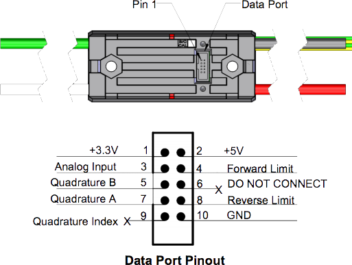

## Talon SRX


The Talon SRX is a new iteration of the Talon motor controller series that was introduced in the 2015 FRC season. The SRX is unique as it is CAN enabled and capable of operating with the roboRIO, PCM, and VRM, which all use CAN protocols. Because the Talon SRX was designed without a built-in ventilation system, you should mount it in an area with adequate airflow. The user guide recommends mounting it to the robot’s metal frame because it will act like a giant heatsink.

**Specs**
* Dimensions: 2.75” x 1.85” x .96” tall
* Weight: .2lbs including wires
* 15 kHz output switching frequency
* 60 Amp Continuous current, 100 Amp
* 2 x Mounting Holes (one at each end, 6-32 fasteners)
* Supports CAN (Controller Area Network), SPI (Serial Peripheral Interface), Digital I/O, and USART (Universal Synchronous/Asynchronous Receiver/Transmitter)

####➠ Wiring



####➠ Can


[**Talon SRX User Manual**](http://www.mililanirobotics.org/documentation/electrical/Talon%20SRX%20User%20Manual.pdf)

####➠ Sample Code
[**TalonSRX Class (C++)**](http://mililanirobotics.org/documentation/electrical/WPILib2015C++/classTalonSRX.html)

```c++
#include "WPILib.h"

class RobotDemo : public SampleRobot {
    TalonSRX talonsrx;
    Joystick stick;
public:
    RobotDemo(void):
        talonsrx(1),
        stick(1)
        {
        }
    void OperatorControl() {
        if(stick.GetRawButton(1)) {
            talonsrx.Set(1.0);
        }
        else if(stick.GetRawButton(2)) {
            talonsrx.Set(-1.0);
        }
        else {
            talonsrx.Set(0);
        }
    }
};
START_ROBOT_CLASS(RobotDemo);
```

#### ➠ Explanation

```c++
TalonSRX talonsrx;
```

Declare Talon SRX motor controller as `talon`; declared between public SampleRobot and public : RobotDemo

```c++
talonsrx(1),
```

Initialize talon SRX motor controller as connected to port #1 in the Digital Sidecar (PWM Out); initialized between `public : RobotDemo` and the braces(`{ }`). If it is not the last object initialized, it needs a comma like a list. If it is the last object initialized, no punctuation; no comma, no semicolon, no period, etc. or you will get an error.

```c++
void OperatorControl() {
    if(stick.GetRawButton(1)) {
        talonsrx.Set(1.0);
    }
    else if(stick.GetRawButton(2)) {
        talonsrx.Set(-1.0);
    }
    else {
        talonsrx.Set(0);
    }
}
```
Joystick class is gone into depth in an earlier section of this manual. Motor controllers are put into results of conditions because a free-spinning motor is a waste of power and there is no control over the motor (which is why it is a motor controller) The .Set method of the class accepts a float between `-1.0` to `1.0` as a parameter which sets the speed of the motor to that float. `1.0` is full speed “forward”, `-1.0` is full speed “backward.” The motor when initialized begins at `.Set(0)`. The else `talonsrx.Set(0)` is to stop the motor; unless the motor controller is set to `0`, the motor remains at the last `.Set()` value.
