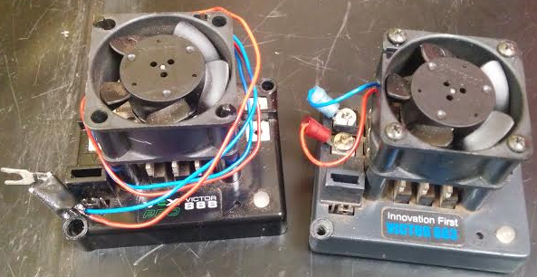
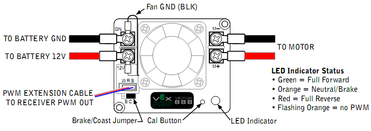
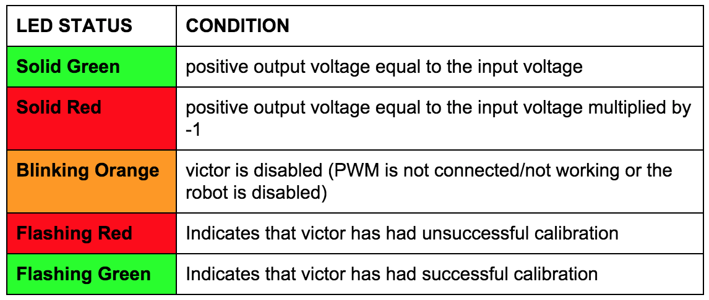

## Victor 888





The victor is similar to the jaguar, but sacrifices computing power for a lighter weight and a smaller size.



When wiring, make sure that the PWM is plugged in so that the black wire is facing the inside (towards the fan). Pay special attention to the M+ M- V+ and V- on the sides of the Victor when wiring it to the motor and the power distribution board.

[**Victor 888 User Manual**](http://www.mililanirobotics.org/documentation/electrical/Victor%20888.pdf)

[**Victor 888 - VEX Store**](http://www.vexrobotics.com/217-2769.html)

####➠ Sample Code
[**Victor Class (C++)**](http://mililanirobotics.org/documentation/electrical/WPILib2015C++/classVictor.html)

```c++
#include "WPILib.h"

class RobotDemo : public SampleRobot {
    Victor victor;
    Joystick stick;
public:
    RobotDemo(void):
        victor(1),
        stick(1)
        {
        }

    void OperatorControl() {
        if(stick.GetRawButton(1)) {
            victor.Set(1.0);
        }
        else if(stick.GetRawButton(2)) {
            victor.Set(-1.0);
        }
        else {
            victor.Set(0);
        }
    }
};

START_ROBOT_CLASS(RobotDemo);
```

####➠ Explanation
```c++
Victor victor;
```

Declare victor motor controller as `victor`; declared between `public SampleRobot` and `public : RobotDemo`

`victor(1),`

Initialize victor motor controller as port # 1 in Digital sidecar PWM Out. This is stated between `public : RobotDemo` and the braces(`{ }`). If it is not the last object initialized, it needs a comma like a list. If it is the last object initialized, no punctuation; no comma, no semicolon, no period, etc. or you will get an error.

```c++
void OperatorControl() {
    if(stick.GetRawButton(1)) {
        victor.Set(1.0);
    }
    else if(stick.GetRawButton(2)) {
        victor.Set(-1.0);
    }
    else {
        victor.Set(0);
    }
}
```

Joystick class is gone into depth in an earlier section of this manual. Motor controllers are put into results of conditions because a free-spinning motor is a waste of power and there is no control over the motor (which is why it is a motor controller) The `.Set` method of the class accepts a float between `-1.0` to `1.0` as a parameter which sets the speed of the motor to that float. `1.0` is full speed “forward”, `-1.0` is full speed “backward.” The motor when initialized begins at `.Set(0)`. The else `victor.Set(0)` is to stop the motor; unless the motor controller is set to `0`, the motor remains at the last `.Set()` value.

NOTE: The 883, 884 and 885 models have been discontinued, but the manufacturer’s documentation can be found below.

[**Victor 883/885 User Manual**](http://www.mililanirobotics.org/documentation/electrical/Victor%20883-885.pdf)

[**Victor 884 User Manual**](http://www.mililanirobotics.org/documentation/electrical/Victor%20884.pdf)
