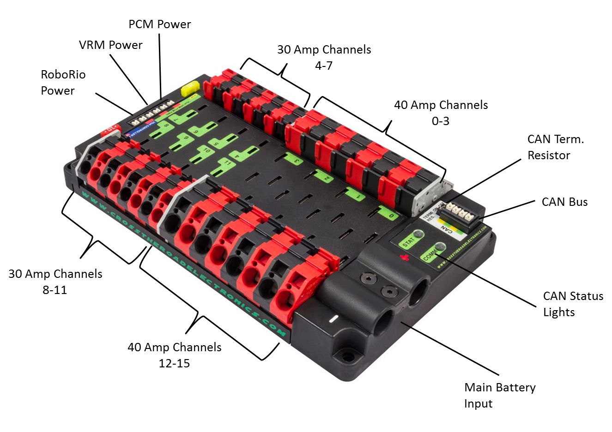

# The PDP

The PDP is a newer iteration of the PDB that was in the Kit of Parts given to teams in the 2015 FRC season. The main difference between the two is that the PDP is slightly smaller, lighter, and has updated connectors, which includes the Weidmuller Connectors used on the CAN bus. In general, the PDP serves the same function as the PDB, distributing power to the system, but is improved to better reflect the updates made to the rest of the control system.

 
**Specs**  
* Dimensions: 7.586” x 4.748” x 1.442” tall (rough)  
* Weight: 1 lb and 5.3 oz  
* 4 Mounting holes (one at each corner, smaller than 1/4-20 and larger than 10-32 fasteners)  
* Connectors  
    * Main Battery Input
        * 2 Bushing lugs
        * Thread M6x1 (size 6 mm)
    * Power Channels (0-15)
        * 8 Red / 8 Black WAGO Connectors 30 Amp Channels            (4-11)
        * 8 Red / 8 Black WAGO Connectors 40 Amp Channels            (0-3, 12-15)
        * 6 Position Weidmuller Connectors (accept 24-16             AWG)
            * 1 x 20 amp fuse (used for PCM and VRM)
            * 1 x 10 amp fuse (used for RoboRIO)
    * 8 x 20 / 30 amp Thermal Breaker by Snap Action             slots (channels 4-11)
    * 8 x 40 amp Thermal Breaker by Snap Action slots            (channels 0-3, 12-15)
    * CAN
        * 4 Position Weidmuller Connectors
            * 2 Yellow CAN High
            * 2 Green CAN Low
* Status Lights  
    * Both Lights are always the same color / blinking           pattern with the exception of booting up
    * Fast Green Blink - Robot is enabled
    * Slow Green Blink - Robot is disabled
    * Slow Orange Blink - Robot is disabled & Sticky Fault       present (low voltage, < 6.5 V
    * Slow Red Blink - No CAN communication
    * Boot Status lights (COMM LED only)
        * Green / Orange Blink - Device is in boot-loader /         Field-upgrade necessary
    * Both LEDs off - Device is NOT powered
