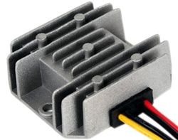
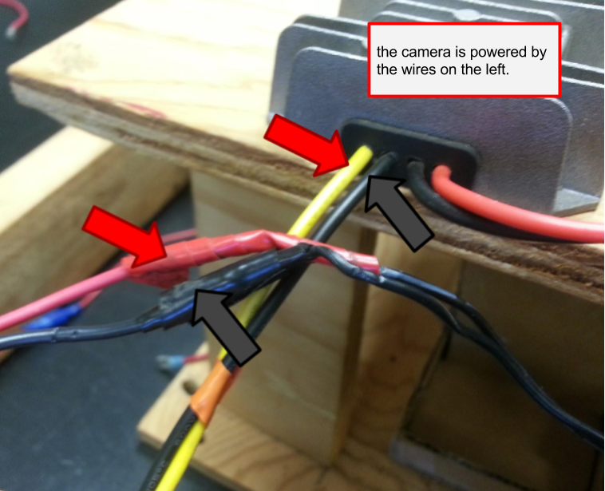
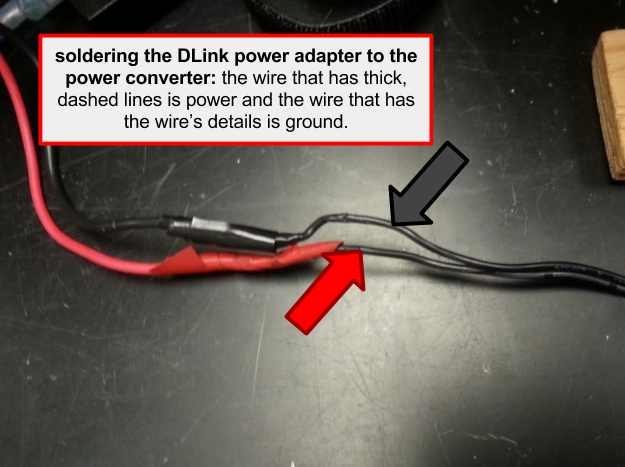

## The Power Converter

Although we have the voltage regulator module, if you are looking to power > 1 camera, you will need a power converter so the camera can operate under it's necessary voltage. The power converter plugs into the PDP with a 20A circuit breaker.

**Wiring the Power Converter**

