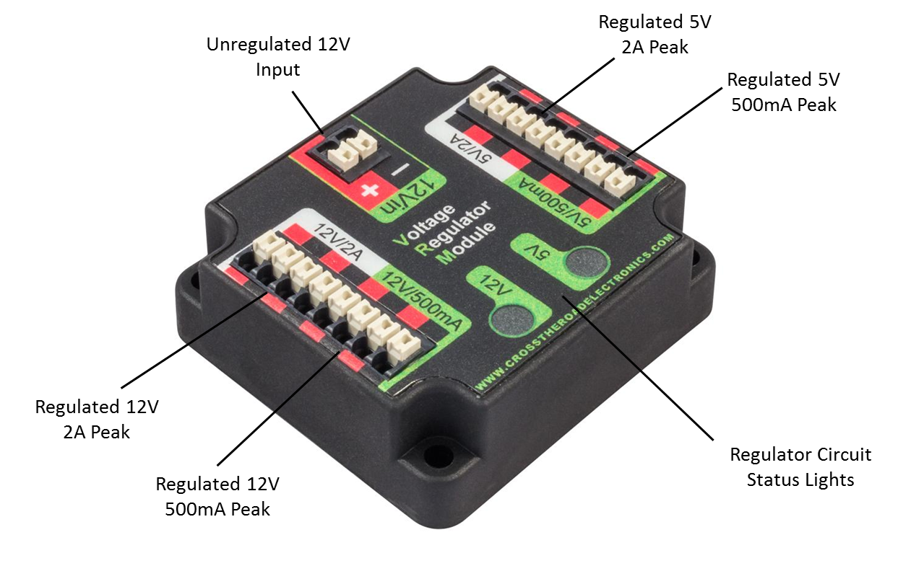
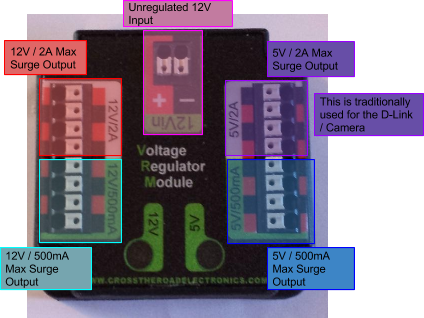

## The Voltage Regulator Module
#### ➠ General VRM Overview

*Image courtesy of http://khengineering.github.io/*

#### ➠ What is a VRM?

The Voltage Regulator Module (VRM) is a new component introduced in the 2015 FRC season as part of the Kit of Parts. This replaces the 12V and 5V regulator and special protected and unprotected power outputs on the old PDB. The purpose of the VRM is to act as a DC to DC converter, and both boost and buck voltage regulation. The VRM is required when using components that require special protected power.

**Specs**
* Dimensions: 2.220” x 2.030” x 0.784” Tall

* Weight: 1.8 oz

* 4 mounting holes (one at each corner, 6-32 fasteners)

* Connectors (all use Weidmuller connectors, accepting 24 - 16 AWG)

* 4 x connectors for regulated 12V / 2A max surge / 1.5A limit power output

* 4 x connectors for regulated 12V / 500mA max surge power output

* 4 x connectors for regulated 5V / 2A max surge / 1.5A limit power output

* 4 x connectors for regulated 5V / 500mA max surge power output

* 2 x connectors for unregulated 12V input

**Status Lights**
* 5V/500mA Status LED
    * On - 5V channels are powered
    * Off - Breaker has tripped
* 12V/500mA Status LED
    * On - 12V channels are powered
    * Off - Breaker has tripped
* LEDs not affected when 2A channels are limited

* Flickering - Low voltage (<4V)

#### ➠ Wiring

All ports use Weidmuller connectors, accepting 24 - 16 AWG

**Note:** There are two separate power supplies, 12V and 5V. There is just enough power to run both a D-Link and Camera on the 5V rail, but you may need to use a separate 12V to 5V adapter.

