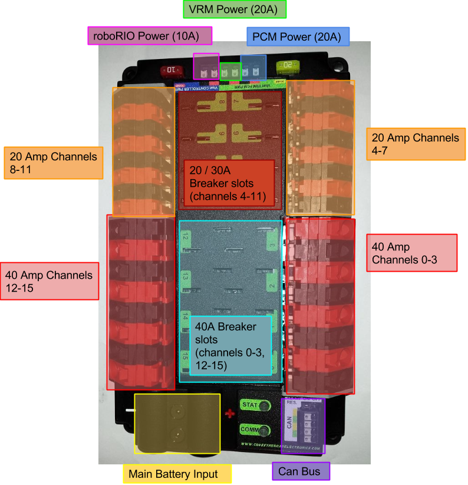
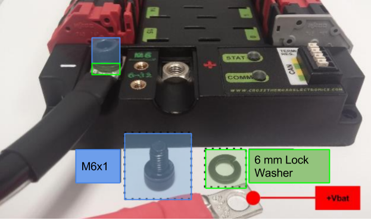
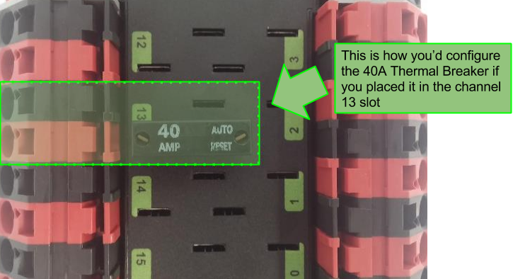
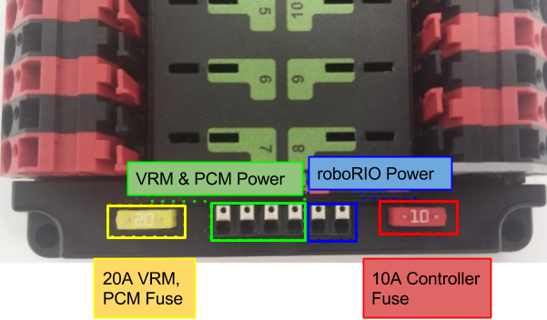
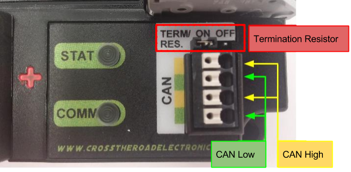

# Wiring

###Main Battery Input
  

**40 Amp Thermal Breaker by Snap Action slots (channels 0-3, 12-15)** 
 

**6 Weidmuller connectors for PCM, VRM, and roboRIO**  
 

**4 CAN connectors, Terminal Resistor Jumper, and the Status Lights**  
Only place Terminal Resistor Jumper when the PDP is at the end of the CAN bus.
 
