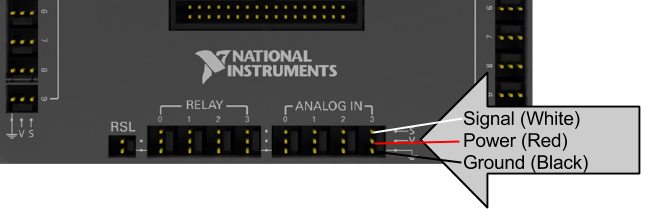

# Gyro


### ➠ General Overview
The gyro measures angular changes on the top surface axis. The voltage output depends on the angular change it detects. It can also measure the rate of angular change. It normally would be used in tandem with the accelerometer, since the accelerometer can detect absolute angle vs angular motion. The gyro best functions at the center of the robot’s axis of rotation. When mounting it, keep the gyro away from anything that might fry the gyro, so it is best to electronically isolate it from the main mounting board. Noteworthy is that it also contains a temperature sensor, useful for detecting heat within the robot system during operation if a thermal detector is not available or during a match.

### ➠ Specifications
The gyro accepts a +5V for power, can record up to 250 O/s, has a nominal output of 2.5V at standstill, adds 7mV/O/s. Board carries a filter set to 400 Hz. Contains integrated temperature sensor which accepts a +5V for power with nominal output at 2.5V at 25OC, adds 9mV/OC.

### ➠ Wiring

Wires to the roboRIO Analog IN ports using a female-to-female PWM. Ground, Power, Signal from outside in respectively.  


Wires to the Gyro sensor with the other end of the female-to-female PWM. Ground, Power, Signal from outside in respectively


### ➠ Programming
```c++
#include "WPILib.h"

class Robot: public SampleRobot
{
	Joystick stick; // only joystick
	Gyro gyro; // Gyro sensor
	double angleTurn = 0.0;
	double angleRate = 0.0;
	double driftRate = 0.0;

public:
	Robot() :
			stick(0),  // these must be initialized in the same order
			gyro(0)	// as they are declared above.
	{
		gyro.InitGyro();
	}

	void OperatorControl() {
		gyro.Reset();
		while (IsOperatorControl() && IsEnabled()) {
			if(stick.GetRawButton(2)) {
				gyro.Reset();
				Wait(2);
				driftRate = gyro.GetAngle();
				SmartDashboard::PutNumber("drift rate", driftRate);
			}
			angleTurn = gyro.GetAngle();
			angleRate = gyro.GetRate();
			SmartDashboard::PutNumber("Gyro angle", angleTurn);
			SmartDashboard::PutNumber("Rate of turning", angleRate);
			Wait(0.05);
		}
	}
};

START_ROBOT_CLASS(Robot);
```
