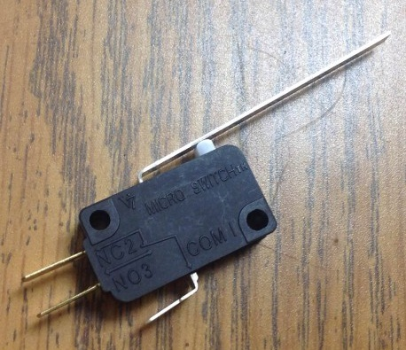
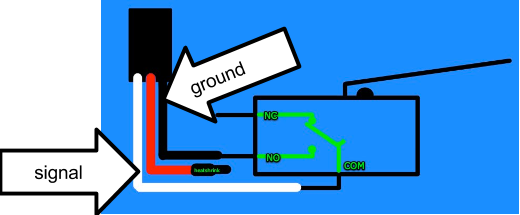
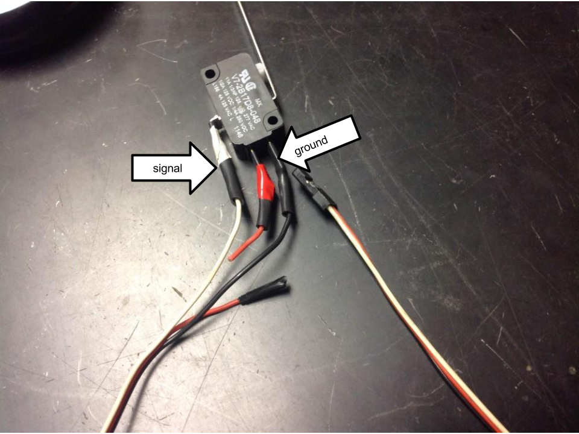

# Microswitch

### ➠ Use

The microswitch is usually used to keep something from overextending or surpassing some distance. When the switch not pushed, the switch is NC (normally closed), returning 1. When the switch pushed, the switch is  NO (Normally Open), returning 0.

### ➠ Wiring 

The switch is plugged into the Digital IO section of the digital sidecar via PWM.

### ➠ Programming
Declared and instantiated as a DigitalInput
When switch NC, returns 0
When switch NO, returns 1

Declaration: DigitalInput switch; 
Instantiation: switch (1) //port number in the digital sidecar
Using Microswitch: switch.Get(); //returns either 0 or 1
