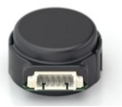
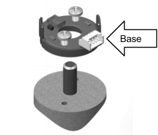
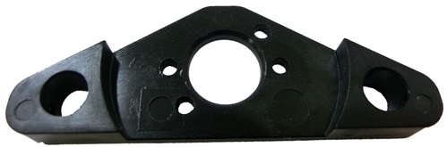
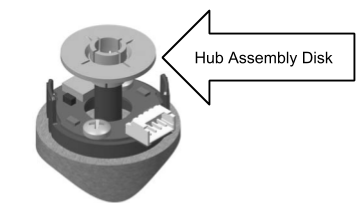
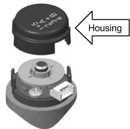
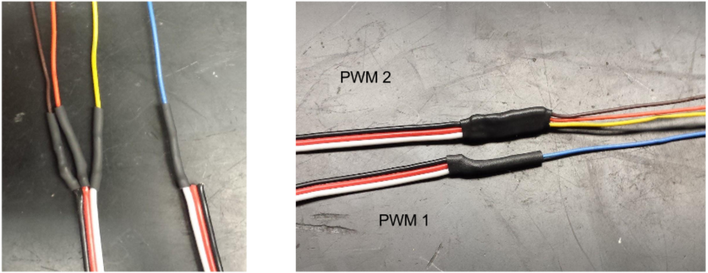
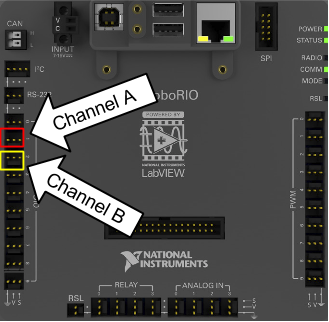

# Optical Encoder

### ➠ Use

The optical encoder is the most common type of encoder in FRC that uses one or more LEDs pointed at a strip or slit code wheel and two detectors 90 degrees apart to measure the rotation speed of a wheel or other shafts. The encoder pictured to the left is a **US Digital E4P (am-0174)** optical encoder.

**Specs**
* Max RPM: 10,000 RPM
* 100-360 cycles per revolution
* 400-1440 pulses per revolution
* Minimum shaft length: .375” (⅜)
* Shaft Diameter: .079” to .250”
* Weight: .018 lbs

### ➠ Assembly
1. Place base over shaft. Secure base to mounting surface using either the two screws on the base or a mounting pad.

*Mounting the base without a mount pad*

*Mounting pad placed under the base if used.*

2. Place hub disk assembly onto shaft with pattern-side down towards base. It should not be completely pressed down.


3. Use the spacer (lip facing downwards) to push the hub disk assembly to the appropriate location on the shaft. The disk should not be touching anything besides the shaft and the spacer, and there should be a considerable gap between the disk and the base.


4. Remove the spacer while ensuring that the disk stays in place.

5. Place the housing on top of the encoder. Using your thumb and finger, squeeze ears together to ensure that the cover fully latches.


### ➠ Mounting
It is easiest if the optical encoder is placed on the output shaft as there is a direct correlation between the rotation of the shaft and the movement of whatever it controls. Also ensure that the optical encoder is perfectly centered around the shaft.

### ➠ Storage
The optical encoder can get scratched easily so it should be stored in a special case to prevent scratching or in a place that will not scratch the surface of the disk. 

### ➠ Wiring
The wiring for the optical encoder uses two channels (Digital IO; A/B) for the PDP so four wires have to be soldered to two PWMs. 
Orange: Power-------------------------------> PWM 2 Power

Blue: Channel A------------------------------> PWM 1 Signal

Brown: Ground-------------------------------> PWM 2 Ground

Yellow:	Channel B----------------------------> PWM 2 Signal




### ➠ Programming
```c++
//Code Used for Testing with roboRIO
#include "WPILib.h"

/**
 * Encoder Test Using Motor
 */
class Robot : public SampleRobot {
	Encoder encoder;
	Joystick logitech;
	Talon talon;

	// update every 0.005 seconds/5 milliseconds.
	double kUpdatePeriod = 0.005;

public:
	Robot() :
			encoder(1, 2, false, Encoder::k4X),
			logitech(0), // Initialize logitech on port 0.
			talon(0) // Initialize the Talon on channel 0.
	{
		encoder.SetSamplesToAverage(5); // Used to reduce noise in period
		encoder.SetDistancePerPulse(1.0/360); // This makes it so that GetDistance will return 1 when the shaft 
        // makes a full rotation and that GetRate will be in Revs per second
	}
	void OperatorControl() {
		encoder.Reset();
		while (IsOperatorControl() && IsEnabled()) {
			talon.Set(logitech.GetY()); 
            //gets the y-axis on the LEFT logitech
			while(encoder.GetDistance() < 2) {
				talon.Set(-0.2);
		        SmartDashboard::PutNumber("Encoder Distance", encoder.GetDistance()); 
                // prints displacement in revolutions
		        SmartDashboard::PutNumber("Encoder Rate", encoder.GetRate()); 
                // prints rate in Revs per second 
				Wait(kUpdatePeriod);
			}
		}
	}
};

START_ROBOT_CLASS(Robot);
```