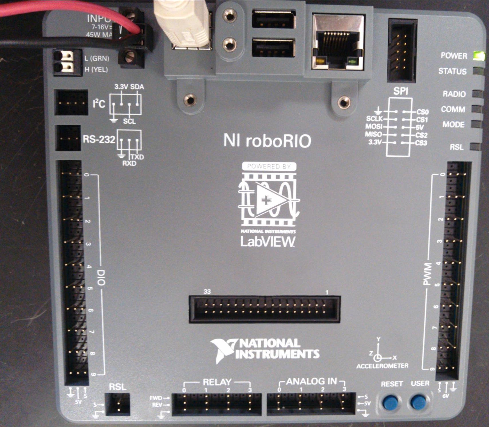
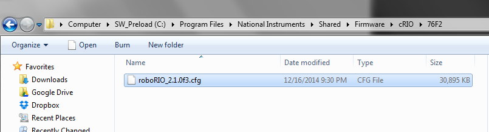
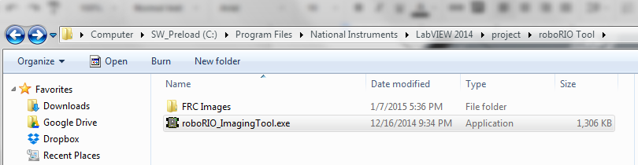
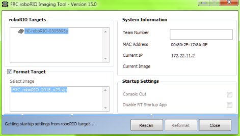

## Configuring the roboRIO
Before a brand new roboRIO can be put into action, you must first install the latest roboRIO firmware and then re-image the software using the latest version. Before you begin, ensure that the NI (National Instruments) suite is updated. The NI update as well as instructions for downloading it can be found below: https://wpilib.screenstepslive.com/s/4485/m/13503/l/144150-installing-the-frc-2015-update-suite-all-languages

###➠ Installing and Updating the roboRIO firmware
Prior to the imaging of the roboRIO, the firmware on the roboRIO must be upgraded to the latest version. This process will provide the bootloader, safemode, and firmware for the roboRIO. While it is possible to do this using an ethernet connection, it is not recommended. The firmware can be updated using your system’s web browser in the following steps:

1. As shown in the electrical layout below, connect the roboRIO to your computer using a printer USB cable and supply power to the roboRIO.  

2. The driver should install automatically. Once the download is complete, open a web browser on your computer.

3. In the address bar of the web browser, type “172.22.11.2” and press enter.

4. Click login. “admin” will be the username and leave the password field blank. Then, click “Update Firmware”

5. Look for the roboRIO (.cfg file in your National Instruments folder. The default location of this file is under “Program Files\National Instruments\Shared\Firmware\cRIO\76F2”  

6. Click “Begin Update”

###➠ Imaging and Reimaging the roboRIO
The roboRIO Image loads the FPGA, operating system, linux file system, and default settings for the roboRIO. Now that the roboRIO has the latest firmware installed, it is now possible to image the roboRIO in the follow steps:

1. Ensure that the roboRIO is still powered from the PDP (Power Distribution Panel) and is still securely plugged into the computer using a printer USB cable.

2. Look for the roboRIO Imaging tool (.exe file) as shown below. It is located within the National Instruments file folder, and its default location is “National Instruments\LabVIEW 2014\project\roboRIO”  

3. Double click to run the “roboRIO_ImagingTool.exe” application, and the the interface  will attempt to identify connected roboRIO devices.

4. Enter your team number under “System Information.” Select the latest version of the roboRIO Image (indicated by the highest version number) and the name of the roboRIO you intend to image.

5. Select the Format Target option but make sure that the Console Out and Disable RT Startup App options are not selected. Click “Reformat”  

6. Once the Imaging is complete, click “OK” on the completion message and Reboot the roboRIO using the Reset button.
