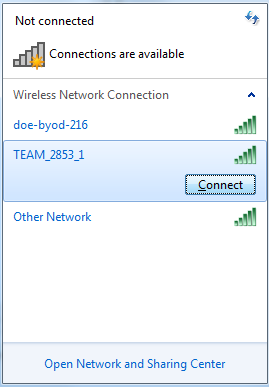

## Connecting to the roboRIO Wirelessly
1. Change the IP address and subnet mask of your computer. The IP address should be “10.xx.yy.100”, with xx and yy being your four digit team number, and the subnet mask should “255.0.0.0”  

2. Connect to the team’s wireless router. It’s that easy!  

