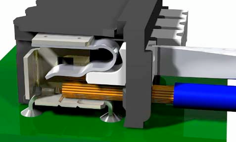

## General roboRIO Overview
###➠ What is a roboRIO?

A roboRIO is a more recent version of the cRIO (compact Reconfigurable Input/Output) that was introduced to FRC teams in the 2015 season. It is a faster, smaller, and more powerful version of the previous controller. Like the cRIO, it acts as the brain of the robot, and connects to a D-Link router using an ethernet cable. Additionally, the roboRIO combines the functions of the digital sidecar including the digital and analog modules of the previous control system. The roboRIO is more robust than the digital sidecar, and is protected from shorts between its external pins.

####Specs

**Basic Overview**
* Dual-Core ARM Cortex 667 MHz processor
* 256 MB RAM
* 512 MB NAND storage memory
* Linux Operating System with real-time extensions
Supports LABVIEW, C++, and Java

**Physical/Electrical Characteristics**
* 6.8 V to 16 V input power (staged brownout from 4.5 V to 6.8 V)
* 3.3 V user output (with 1.5 A maximum)
* 5 V user output (with 1 A maximum)
* 6 V servo output (with 2.2 A maximum)
* Operating temperature 0°C - 40°C
* Storage temperature -20°C - 70°C
* 5.7 inches by 5.6 inches, weighs 12 ounces
* I/O and Communication Ports
    * 10 dedicated PWM channels
    * 10 DIO dedicated channels
    * 4 bi-directional
    * Relay Control channels
    * 2 USB Host ports
    * 1 USB Device port
    * 1 Ethernet port
    * 1 CAN Port
    * 1 Integrated, 3-axis  accelerometer
    * 12 V Robot signal light channel

###➠ Connectors

Weidmuller Connectors are used to supply power to the roboRIO, PCM (Pneumatic Control Module), and VRM (Voltage Regulator Module). The connector accepts wire gauges from 16 AWG to 24 AWG. Wires can be inserted into or removed from the Wiedmuller connector by pushing down on the white tab using a tiny flathead.

###➠ Wiring Diagram

**Notes:**
* The CAN Ports on the roboRIO are used to connect to the PCM and PDP
* The roboRIO is connected to the PDP through its input power ports. Do not connect the roboRIO directly to the robot battery.
* The USB Device port can be used to connect to a computer to update the roboRIO firmware and to reimage the roboRIO.
* The LEDs indicate the current status of the roboRIO.
The roboRIO can be mounted using zip-ties through the mounting features.
* Please see the Appendix for an example wiring of the whole control system.
