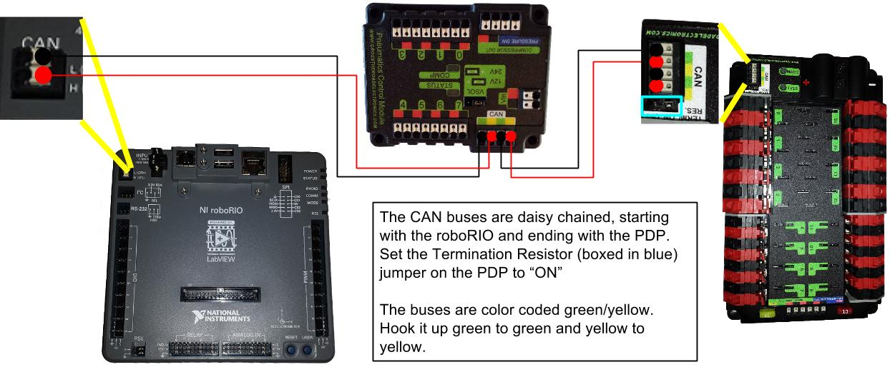

## The CAN Bus
###➠ Introduction
As of the 2015 FRC game, Recycle Rush, teams are required to use the CAN bus on the roboRIO when connecting to the PCM, PDP, Talon SRXs, and Jaguars (R 60-62).

This section will not go over how to use CAN on the Talon SRX (you can read CTR’s Talon SRX User guide) or the Jaguar, because our team does not have experience with these items.

By connecting the control system together with CAN, the PDP and PCM can communicate with each other. The PDP provides monitoring for each of its outputs. A main advantage of this system is that compressors and pressure switches no longer need to be connected to a Relay Spike.

###➠ Wiring the CAN

When wiring, we recommend twisting the two wires together. There are no specific buses for input/output but by convention, we use the left bus as input and right bus as output.

If you are not using the roboRIO or PDP as terminals for the CAN chain, terminate the CAN chain by inserting a 120 Ω resistor into the Weidmuller terminals.
