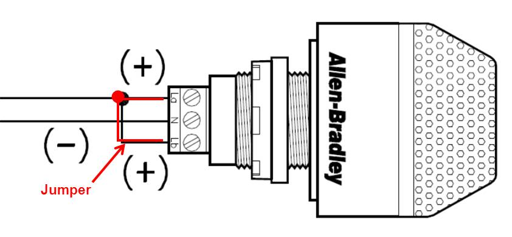
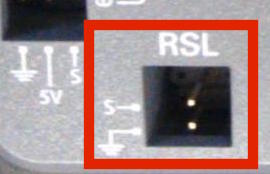

## The Robot Signal Light
###➠ Introduction
The Robot Signal Light (RSL) is **mandatory** during competition and acts as a signal to whether the robot is connected to the FCS, in teleop mode, etc.

###➠ Wiring the RSL

A separate wire acts as a jumper between La and Lb. Connect La to 'S' and N to Ground on the roboRIO.

###➠ RSL Indicators
| Light Code | Meaning |
| -- | -- |
| **Solid ON** | Autonomous enabled |
| **Solid ON but blinks off every 1.5 sec** | Teleop enabled |
| **Slow blink (900ms ON / 900ms OFF)** | System disabled by system watchdog, user watchdog, or driver station set to disabled |
| **Fast-slow (200ms ON / 900ms OFF)** | Low battery (<12V) or no user code AND system disabled either by system watchdog, user watchdog, or Driver Station set to disabled. |
| **Fast (200ms ON / 200ms OFF)** | System error; no Driver station communication; bad cRIO image, bad team ID, extensive communication errors |

