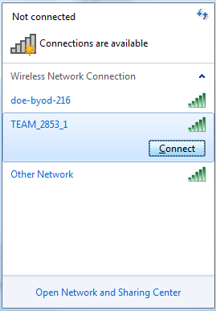
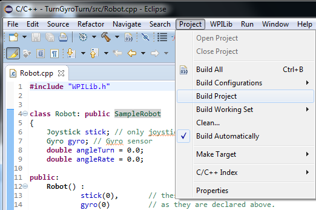
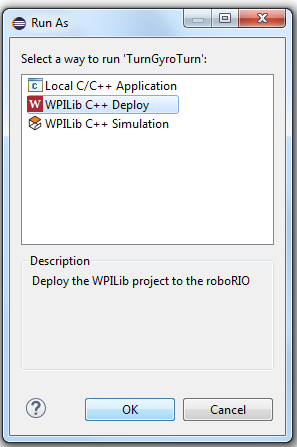

## Uploading Code to the roboRIO
With the introduction of the roboRIO to FRC teams in 2015, uploading code to the robot is made easy! Here’s the steps:

1. **Establish a network connection to your robot network.** On your computer, go to your network connections and connect to the router that is connected to the roboRIO. Don’t worry if you’re already connected to another network, as you will automatically disconnect from that network connection.  
 
*Connecting to a network*

2. **Build your Project.** Click the “Project” option and then click “Build Project.” To upload code to the roboRIO, it is only necessary to build the project for uploading code that hasn’t been build in the past or was modified, but it’s a good habit to always build your projects before uploading them to the robot. Therefore, we recommended having your “Build Automatically” setting enabled.  
 
*Building an Eclipse project*

3. **Run your code.** Press Ctrl + F11, and when prompted how you would like to run your code, select the “WPILib C++ Deploy” option and press OK. Now you’re done! Wait for the Driver Station to show that communications has been established, and you’ll be on your way to testing your code!  
 
*Running your code using “WPILib C++ Deploy”*
