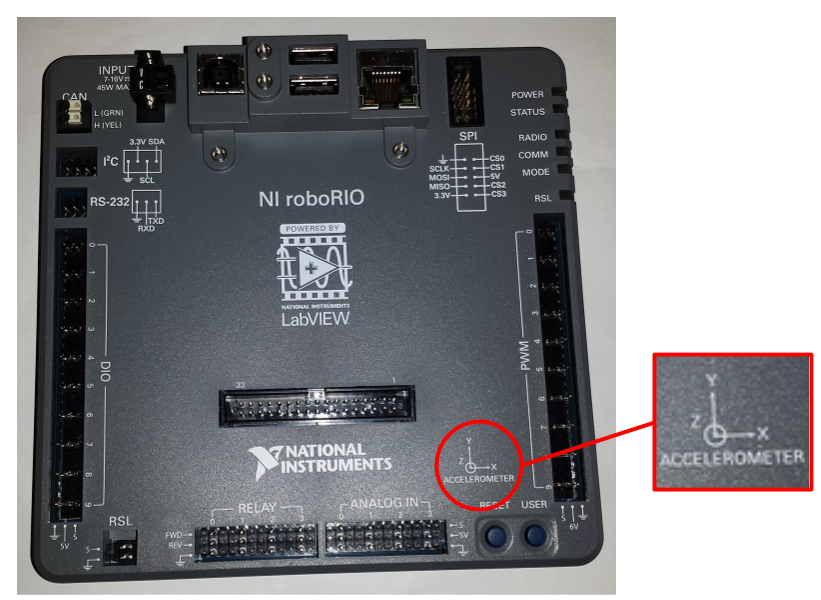

# roboRIO Accelerometer
### ➠ General Overview

One of the many features that comes with the RoboRIO is the built-in 3-axis accelerometer, which has the potential to replace the ADXL345 accelerometer that also comes in the 2015 Kit of Parts. The purpose of this device is to determine the proper acceleration of an object, which is its acceleration relative to freefall. This can be used to determine how much the robot is tilted or a way to monitor motion.

### ➠ Specifications
* Axes: 3 (x, y, and z)
* Sample Rate: 800 Samples per second
* Resolution: 12 bits
* Range: ±8g (gravity)
* Noise: 3.9 mgms typical at 25° C


###➠ The Code
This is the code we used to determine the direction of each axis as well as the stability of the returned values.

```c++
#include "WPILib.h"

class Robot: public SampleRobot {
	BuiltInAccelerometer accelerometer;

	const double kUpdatePeriod = 0.005; // 5milliseconds / 0.005 seconds.
public:
	//sets the range of the accelerometer to be + or - 8G (units of gravity)
	Robot() : accelerometer(Accelerometer::Range::kRange_8G) {
	
	}
	void OperatorControl() {
		double xAcceleration;	//acceleration on the x-axis
		double yAcceleration;	//acceleration on the y-axis	
		double zAcceleration;	//acceleration on the z-axis
		double previousX = 0;	//Previous recursive average on x-axis
		double previousY = 0;	//Previous recursive average on y-axis
		double previousZ = 1;	//Previous recursive average on z-axis

		while (IsOperatorControl() && IsEnabled()) {
			xAcceleration = accelerometer.GetX(); //returns x-axis accel
			yAcceleration = accelerometer.GetY(); //returns y-axis accel
			zAcceleration = accelerometer.GetZ(); //returns z-axis accel

			SmartDashboard::PutNumber("X-Axis G:", xAcceleration);
			SmartDashboard::PutNumber("Y-Axis G:", yAcceleration);
			SmartDashboard::PutNumber("Z-Axis G:", zAcceleration);

			SmartDashboard::PutNumber("Recrusive X-Axis Average:", ((xAcceleration*0.1) + (0.9*previousX)));
			//returns a recursive average for the x-axis
			SmartDashboard::PutNumber(“Recursive Y-Axis Average:", ((yAcceleration*0.1) + (0.9*previousY)));
			//returns a recursive average for the y-axis
			SmartDashboard::PutNumber(“Recursive Z-Axis Average:”, ((zAcceleration*0.1) + (0.9*previousZ)));
			//returns a recursive average for the z-axis
			previousX = (xAcceleration*0.1) + (0.9*previousX);
			previousY = (yAcceleration*0.1) + (0.9*previousY);
			previousZ = (zAcceleration*0.1) + (0.9*previousZ);
			Wait(kUpdatePeriod); // Wait a short bit before updating again
		}
	}
};

START_ROBOT_CLASS(Robot);
```

### ➠ The Explanation
```c++
BuiltInAccelerometer accelerometer;
```

Declare the RoboRIO accelerometer as BuiltInAccelerometer;  declared between `public SampleRobot` and `public : RobotDemo`

```c++
public:
	//sets the range of the accelerometer to be + or - 8G (units of gravity)
	Robot() : accelerometer(Accelerometer::Range::kRange_8G) {
	
	}
```

Initializes the roboRIO accelerometer with a range of +/- 8Gs, which is the acceleration in units of gravity (9.81m/s). This is the maximum range that the device is capable of. There is no need to input pwm ports as the accelerometer is built in.

```c++
void OperatorControl() {
		double xAcceleration;	//acceleration on the x-axis
		double yAcceleration;	//acceleration on the y-axis	
		double zAcceleration;	//acceleration on the z-axis
		double previousX = 0;	//Previous recursive average on x-axis
		double previousY = 0;	//Previous recursive average on y-axis
		double previousZ = 1;	//Previous recursive average on z-axis
```

In this section we initialize the variables that we will be using for output on the SmartDashboard. Since the accelerometer has 3 axes, we need a variable for each one (x, y, and z). The previous axis variables are used to determine a recursive average that is explained later in this document. They are meant to store the value of the recursive average of all previously returned values. `previousX` and `previousY` are equal to 0 because that is the expected value when the roboRIO is at rest and on a perfectly horizontal surface. `previousZ` is equal to 1 because the roboRIO is not in freefall, which is what an accelerometer measures acceleration in reference to.

```c++
    while (IsOperatorControl() && IsEnabled()) {
		xAcceleration = accelerometer.GetX(); //returns x-axis accel
		yAcceleration = accelerometer.GetY(); //returns y-axis accel
		zAcceleration = accelerometer.GetZ(); //returns z-axis accel

		SmartDashboard::PutNumber("X-Axis G:", xAcceleration);
		SmartDashboard::PutNumber("Y-Axis G:", yAcceleration);
		SmartDashboard::PutNumber("Z-Axis G:", zAcceleration);
```

Here, the variables `xAcceleration`, `yAcceleration`, and `zAcceleration` are being set to the current values of the accelerometer pertaining to the x, y, and z axis. After updating these values, they are then sent to the SmartDashboard to be read in the form of a running value or a table.
```c++
            SmartDashboard::PutNumber("Recrusive X-Axis Average:", ((xAcceleration*0.1) + (0.9*previousX)));
			//returns a recursive average for the x-axis
			SmartDashboard::PutNumber(“Recursive Y-Axis Average:", ((yAcceleration*0.1) + (0.9*previousY)));
			//returns a recursive average for the y-axis
			SmartDashboard::PutNumber(“Recursive Z-Axis Average:”, ((zAcceleration*0.1) + (0.9*previousZ)));
			//returns a recursive average for the z-axis
			previousX = (xAcceleration*0.1) + (0.9*previousX);
			previousY = (yAcceleration*0.1) + (0.9*previousY);
			previousZ = (zAcceleration*0.1) + (0.9*previousZ);
			Wait(kUpdatePeriod); // Wait a short bit before updating again
        }
	}
};
START_ROBOT_CLASS(Robot);
```

Here we calculate the recursive average for each axis which can be useful during testing. The purpose of having this recursive average is to effectively reduce the sensitivity of the returned values to fluctuations. This allows you to get a more accurate and stable reading for each axis of the accelerometer, and could be used to test for varying angles that the accelerometer is tilted.

This simple recursive average algorithm is done by taking .1 of the current value for an axis and adding it to .9 of the previous average. This essentially means that we have a constantly changing average. Note that the sensitivity of this algorithm can be adjusted by changing the “0.1” and “0.9” values. However, remember that the two multipliers must add to a value of 1, because the average will tend to continue increasing or decreasing depending on how the multipliers are adjusted. If you have a multipliers of .01 and .99, the current average will be much less sensitive to change as the weight of each new number is drastically decreased.

